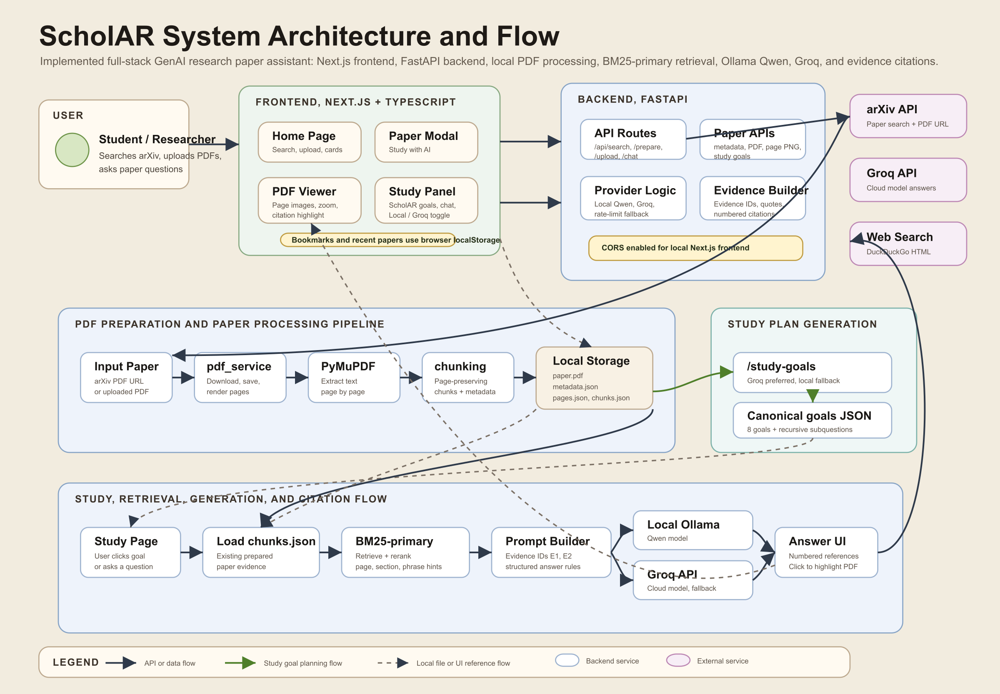
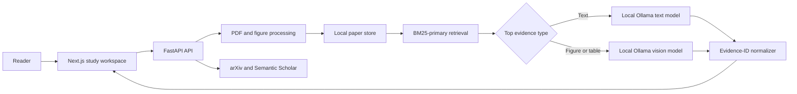

# ScholAR

**A local-first research companion for reading scientific papers with inspectable evidence.**

ScholAR lets a reader search arXiv or upload a PDF, study the document beside an AI assistant, ask text and figure questions, load cited papers, and follow every generated citation back to a real page and quoted passage. Text and vision inference run locally through Ollama. Only paper discovery, acquisition, and reference resolution use public network services.

> **Project status:** active research prototype. The previous conference submission has been canceled. The repository is intentionally venue-neutral while the research framing, human evaluation, and next submission target are decided.



## Why ScholAR exists

Reading a paper is not the same as summarizing it. A reader needs to connect the problem, method, evidence, experiments, limitations, and cited work. General PDF chat can sound certain while inventing or misusing page references. ScholAR was built around a narrower promise:

- keep the paper visible while the reader asks questions;
- retrieve a small, inspectable evidence set;
- prevent the model from writing page numbers directly;
- map citations back to pages in application code;
- run private documents through local models;
- report where the evidence does not support the original research hypothesis.

The last point matters. Stronger evaluation showed that valid citation provenance does **not** guarantee faithful answers. ScholAR can guarantee that a cited page was retrieved and exists, but the current page-support rate is 65.9%. This changed the research story from "grounding solves faithfulness" to a more useful result: **indirect citation grounding provides provenance and auditability, not faithfulness by itself.**

## What works today

- arXiv search with local caching, reranking, and prepared-paper fallback;
- PDF upload with a 50 MB limit and basic PDF validation;
- page-wise extraction, rendering, chunking, figure/table extraction, and local JSON storage;
- BM25-primary retrieval with query expansion, section cues, page hints, and explicit figure routing;
- evidence-ID citations that the backend resolves into numbered page references;
- local text generation and multimodal figure/table answering through Ollama;
- paper-specific study goals with deterministic fallbacks;
- Semantic Scholar and arXiv reference resolution for multi-document study;
- a Next.js study workspace with PDF viewing, chat, study goals, and references;
- automated retrieval, generation, abstention, visual, multi-document, efficiency, and baseline evaluations;
- a complete blinded human-evaluation pipeline, with annotation still pending.

## Architecture at a glance



The model sees short-lived evidence identifiers such as `E1` and `E2`, never free-form page-number instructions. After generation, the backend validates the identifiers, converts them to `[1]`, `[2]`, and attaches the stored page, quote, chunk, and source-paper metadata.

Read [the complete project guide](docs/PROJECT_GUIDE.md) for the data model, API contract, request flows, component responsibilities, failure behavior, and contributor handoff.

## Set up ScholAR locally

The complete onboarding guide is [docs/SETUP.md](docs/SETUP.md). It includes macOS, Linux, Windows PowerShell, configuration, first-paper import, verification, and troubleshooting.

### Prerequisites

- Python 3.11 or 3.12
- Node.js 18 or newer; Node.js 20 LTS is recommended
- [Ollama](https://ollama.com/)
- Git and Make for the fast macOS/Linux path

The current default is `qwen3.5:9b`. Evaluation also uses `gemma4:12b`, `llama3.1:8b`, and `mistral:7b`. Visual questions require a multimodal model.

### 1. Clone and install

```bash
git clone https://github.com/prithvi-kaizen/ScholAR.git
cd ScholAR
make setup
```

`make setup` creates the Python environment, installs locked backend and frontend dependencies, and creates local configuration files without overwriting existing ones.

### 2. Prepare Ollama

```bash
ollama pull qwen3.5:9b
```

Start `ollama serve` only if the Ollama desktop application is not already running. Then verify the installation:

```bash
make doctor
```

### 3. Start the application

From the repository root, start the backend in one terminal:

```bash
make backend
```

Start the frontend in a second terminal:

```bash
make frontend
```

Open `http://localhost:3000`, search for an arXiv paper or upload a PDF, and select **Study with AI**. The API health check is `http://localhost:8000/health`, and interactive API documentation is available at `http://localhost:8000/docs`.

Windows users and contributors who do not have Make can follow the exact manual commands in [docs/SETUP.md](docs/SETUP.md). If anything fails, run `make doctor`; it checks Python, packages, Node.js, npm, environment files, Ollama, the configured model, and both application services.

## Repository map

```text
ScholAR/
├── .github/                      # CI and pull-request quality gates
├── backend/
│   ├── main.py                  # FastAPI routes and request orchestration
│   ├── services/                # Search, PDF, retrieval, models, vision, references
│   └── data/papers/             # Local prepared-paper cache, ignored except .gitkeep
├── frontend/
│   ├── app/                     # Next.js routes and global styling
│   ├── components/              # Search, reader, chat, goals, and references UI
│   └── types/                   # Shared frontend data types
├── evaluation/
│   ├── human_eval/              # Blinded human-study instrument and scoring pipeline
│   ├── m3sciqa/                 # Cross-document localization adapter
│   ├── results/                 # Committed, traceable experiment outputs
│   └── run_*.py                 # Reproducible evaluation entry points
├── docs/
│   ├── SCHOLAR_MASTER_GUIDE.md  # Master technical reference and RAG architecture
│   ├── SETUP.md                 # First installation, verification, and troubleshooting
│   ├── PROJECT_GUIDE.md         # Canonical technical and project handoff
│   ├── EXPERIMENTS.md           # Experiment ledger, results, and caveats
│   └── architecture/            # Editable SVG and rendered architecture diagram
├── paper/
│   ├── manuscript.tex           # Venue-neutral research manuscript
│   ├── manuscript.pdf           # Last compiled research draft
│   ├── scholar_references.bib   # Research bibliography
│   └── figures/                 # Manuscript figures
├── scripts/
│   └── doctor.py                # Portable local setup diagnosis
├── CONTRIBUTING.md              # Development and review expectations
├── RESEARCH_ROADMAP.md          # Prioritized work and completion criteria
├── Makefile                     # Common local commands
└── requirements.txt             # Runtime Python dependencies
```

Generated paper data, model caches, virtual environments, Node modules, evaluation exports, and third-party datasets are deliberately excluded from Git.

## Evaluation: what the evidence currently says

The canonical result ledger is [docs/EXPERIMENTS.md](docs/EXPERIMENTS.md). The most important findings are:

| Question | Current evidence | Interpretation |
|---|---:|---|
| Can lexical retrieval find supporting chunks? | BM25-only MRR `0.863`, R@5 `0.94` on 100 mined cases | Strong within this benchmark, but mined questions favor lexical overlap |
| Do reranking heuristics improve BM25? | MRR `0.861` vs `0.863` | No measurable aggregate improvement |
| Does citation provenance imply claim support? | ScholAR page support `0.659`; PDF-chat `0.714` | No. The page is valid, but may not support the claim |
| Does stronger faithfulness scoring change the story? | Judge mean `0.61` vs cosine proxy `0.85` across four models | Yes. Cosine materially inflated the apparent result |
| Does ScholAR beat local RAG baselines on judge faithfulness? | ScholAR `0.453`; vanilla RAG `0.735`; PaperQA2-style `0.779` | No. ScholAR is more correct on must-include recall, but less faithful |
| Does vision help cross-document localization? | M3SciQA MRR `0.180` to `0.474` | Yes. This is the strongest current systems result |
| Is human validation complete? | Instrument and 350 answers prepared; expert scores absent | No. Human evaluation is the highest-priority gap |

These results are intentionally reported together. The repository should never present the older cosine-based numbers without the later entailment-judge correction.

## Running evaluations

Run commands from the repository root.

```bash
# Fast, deterministic retrieval evaluation
make eval-scaled

# Retrieval-support scoring
.venv/bin/python evaluation/run_faithfulness_eval.py \
  --cases evaluation/faithfulness_cases_scaled.json --tag scaled

# Multi-document text localization
.venv/bin/python evaluation/m3sciqa/run_m3sciqa_eval.py --tier text

# Generation evaluations require Ollama and prepared papers
.venv/bin/python evaluation/run_generation_faithfulness_matrix.py --models qwen3.5:9b

# Human study preparation
.venv/bin/python evaluation/human_eval/_build_score_sheet.py
```

See [evaluation/README.md](evaluation/README.md) for every script and [evaluation/human_eval/README.md](evaluation/human_eval/README.md) for the annotation workflow.

## Current priorities

1. Complete expert human evaluation and measure agreement with the automated judge.
2. Repair the central grounding failure by adding claim-level support verification or citation-aware regeneration.
3. Re-run the local baseline comparison after the fix, with repeated seeds where generation is stochastic.
4. Improve figure extraction, mathematical content handling, and citation highlighting.
5. Select a target venue only after the contribution and evaluation package are stable.

The detailed work breakdown and exit criteria are in [RESEARCH_ROADMAP.md](RESEARCH_ROADMAP.md).

## Documentation

- [Master System Guide](docs/SCHOLAR_MASTER_GUIDE.md): complete technical reference, RAG pipeline architecture, baselines, and benchmarks
- [Local setup and first-day guide](docs/SETUP.md): clone, install, configure, run, verify, import, and troubleshoot
- [Project guide](docs/PROJECT_GUIDE.md): product intent, architecture, data flow, API, operations, troubleshooting, and handoff
- [Experiment ledger](docs/EXPERIMENTS.md): completed studies, results, caveats, negative findings, and provenance
- [Research roadmap](RESEARCH_ROADMAP.md): what is done, what is partial, and what must happen next
- [Human evaluation](evaluation/human_eval/README.md): evaluator preparation, blinded scoring, and analysis
- [Manuscript notes](paper/README.md): venue-neutral paper status and build instructions
- [Contributing](CONTRIBUTING.md): local setup, validation, and pull-request expectations

## Scope and privacy

ScholAR is a single-user local research prototype, not a hardened multi-user service. Prepared PDFs and extracted text stay under `backend/data/papers/` and are ignored by Git. Text and vision inference stay local when Ollama is used. arXiv search, PDF downloads, and Semantic Scholar reference resolution make network requests. Do not expose the backend directly to an untrusted network without adding authentication, stricter origin controls, rate limiting, and storage isolation.

## License

Released under the terms in [LICENSE](LICENSE).
