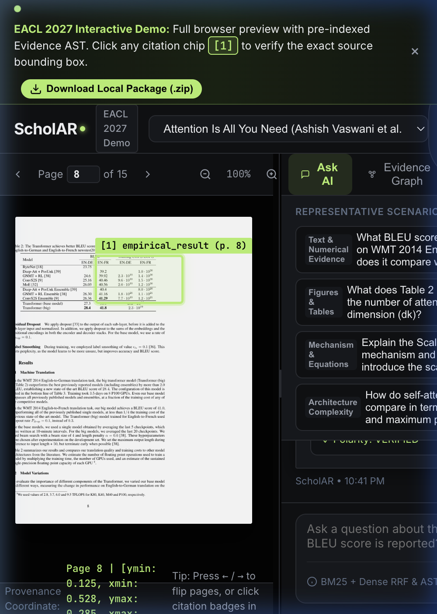

# SCHOLAR: A Local-First Research Assistant for Scientific Papers

[](paper/eacl_demo/main.pdf)
[](https://prithvi-kaizen.github.io/ScholAR/)
[](LICENSE)
[](requirements/locks/base-py312.txt)
[](https://github.com/prithvi-kaizen/ScholAR/releases/tag/eacl-demo-2027-v1.0.0)
[](#runtime-boundary--data-governance)

**SCHOLAR** is a local-first scientific-document assistant designed around **inspectable citation grounding**. It preserves source identity throughout document processing, allowing citations in generated answers to resolve directly to the corresponding paragraph, table, or figure region in the original PDF.

The entire pipeline runs locally on consumer hardware without sending unpublished research drafts, reviewer manuscripts, or queries to external cloud services.

---


---

## EACL 2027 System Demonstration

> **SCHOLAR: A Local-First Research Assistant for Scientific Papers**  
> *Prithviraj$^1$, Sai Amrit Patnaik$^2$, Sangeeta Lamba$^3$, Nidhi Goyal$^1$*  
> $^1$Mahindra University, CSE Dept., Hyderabad, India  
> $^2$Avykt Ehsaas, Hyderabad, India  
> $^3$Central University of Haryana (CUH), India  
>  
> 🌐 **Live Web Demo (No Install):** [https://prithvi-kaizen.github.io/ScholAR/](https://prithvi-kaizen.github.io/ScholAR/)  
> 📄 **Paper (PDF):** [`paper/eacl_demo/main.pdf`](paper/eacl_demo/main.pdf)  
> 📦 **Release Package:** [`release/ScholAR_EACL2027_Demo_v1.0.0.zip`](release/ScholAR_EACL2027_Demo_v1.0.0.zip) (SHA-256: `ebb3a67286c35256ccb7ca78df66371953c4f4f8bc7b791a7b1ce4f83b0e825f`)  
> 📖 **Reviewer & Installation Guide:** [`DEMO_INSTALL.md`](DEMO_INSTALL.md)  
> 🎥 **Demonstration Screencast:** `ScholAR_Demo_Screencast.mp4` (available on GitHub Releases)

### Abstract

> Scientific-document assistants can answer questions over research papers, but verifying their answers still requires readers to locate and inspect the supporting evidence. We present **SCHOLAR**, a local-first scientific-document assistant designed around inspectable citation grounding. SCHOLAR preserves source identity throughout document processing, allowing citations in generated answers to resolve directly to the corresponding paragraph, table, or figure region in the original PDF. The system combines lexical and dense retrieval with local answer generation, post-generation citation checks, and an auditable evidence trace. On a retrospective benchmark of 200 questions across 10 scientific papers, fused retrieval achieves a gold-page Hit@1 of 0.85 and an MRR of 0.905. Across 45 questions sampled from 9 papers, five human raters assigned a mean grounding score of 82.6%. A separate automated audit provides additional diagnostics of grounding and citation quality. SCHOLAR turns generated citations into direct, inspectable links to source evidence while keeping the question-answering workflow local.

### Key Contributions

1. **Source-Preserving Document Representation**: Evidence retains document, page, and normalized bounding-box coordinates throughout document ingestion, retrieval, and generation, keeping citation provenance under deterministic application control.
2. **Inspectable Scientific Question Answering**: Generated citations resolve directly to the corresponding text, figure, or table region in the original PDF, with retrieval and verification actions available through an Evidence Graph audit trace.
3. **Local and Reproducible Evaluation**: Open-source implementation evaluated for evidence retrieval, human grounding, citation quality, and query-time execution on consumer hardware.

---

## System Architecture

```text
1. DOCUMENT REPRESENTATION       2. RETRIEVAL & LOCAL ANSWERING       3. VERIFICATION & INSPECTION
   Scientific PDF                   User Question                        Deterministic Checks
        │                                 │                                    │
   Layout-Aware Parsing             BM25 + Dense                         (Lexical + Numerical)
   (Docling / PyMuPDF)                    │                                    │
        ▼                           Evidence Selection                         ▼
   Evidence Objects ────────────▶   (RRF Fusion k=60)      ──────────▶   Final Cited Answer
   (Text, Figure, Table)                  │                                    │
   [page, bbox, evidence ID]         Local Model                         PDF Region Highlight
                                     (Ollama qwen3.5:9b)                 & Evidence Graph Trace
```

* **Source-Preserving Ingestion**: Docling extracts multi-column text blocks, tables, and figures with PyMuPDF fallback. Parser-produced units are retained as retrieval objects without secondary arbitrary chunking. Each evidence object stores `[document_id, page, modality, content, bounding_box]`.
* **Hybrid Evidence Retrieval**: Lexical retrieval via BM25 combined with dense `all-MiniLM-L6-v2` embeddings using Reciprocal Rank Fusion ($k=60$) and local cross-encoder reranking. Candidate pools include figure/table crops and full pages via keyword, regex, section, and modality heuristics. At most 7 evidence items enter the generation prompt.
* **Deterministic Citation Binding**: Local inference via Ollama (`qwen3.5:9b` by default). Evidence objects are assigned temporary identifiers `[E1]`, `[E2]`. Citations are deterministically mapped and normalized to `[1]`, `[2]`, with hallucinated identifiers discarded under application control.
* **Verification & Audit Traces**: Post-generation diagnostic checks for lexical overlap, numerical consistency, and polarity terms. Emits a complete JSON execution trace for every query (retrieval metadata, evidence, citation records, verifier actions, timings, hardware metadata, and prompt hash).
* **Strict-Local Mode**: Enforces application-level offline execution with local model endpoints and offline parser fallback, ensuring private research drafts never leave the user's workstation.

---

## Online Interactive Reviewer Demonstration (Zero Installation)

Reviewers and readers can evaluate ScholAR immediately in their web browser without downloading packages or setting up local Python/Ollama processes:

🌐 **[Launch Interactive Reviewer Demo on GitHub Pages](https://prithvi-kaizen.github.io/ScholAR/)**



### Key Capabilities in the Web Demo

* **Pre-Indexed Scientific Papers**: Switch between *Attention Is All You Need* (Vaswani et al.), *SCHOLAR: A Local-First Research Assistant* (EACL 2027 Demo Paper), and *Deep Residual Learning (ResNet)* (He et al.).
* **Inspectable Citation Grounding**: Click citation badges (`[1]`, `[2]`, etc.) to jump directly to the cited page and highlight the exact bounding box around the source paragraph, table, or figure.
* **Interactive Evidence Graph**: Explore multi-hop retrieval paths, node modalities (Text, Table, Figure), and verification diagnostics.
* **Diagnostic JSON Audit Trace**: View telemetry with real execution latency breakdown, prompt hashes, and verifier consistency checks.
* **Report Export**: Live export of audited reasoning reports in Markdown (`.md`) and LaTeX (`.tex`).
* **Local System Download Option**: Click **"Download Package (v1.0.0)"** in the top navigation bar to download the self-contained offline package for running with local Ollama on macOS, Linux, or Windows.

### Representative Demonstration Scenarios

* **Text and Numerical Evidence**: Ask queries such as *"What improvement does the proposed method report over baseline X?"* — SCHOLAR extracts experimental tables and text, allowing readers to verify numbers against the exact source context.
* **Figures and Tables**: Ask queries like *"What does Figure 3 show about the ablation?"* — The visual retrieval channel retrieves figure/table crops, allowing users to compare generated descriptions directly with original charts.
* **Evidence-Path Inspection**: Open the interactive **Evidence Graph** to audit every retrieved chunk, its page, modality, relevance score, and export complete reasoning reports in Markdown or LaTeX format.

### Intended Use Cases

* **Researchers**: Compare empirical claims against source tables and experimental sections without manual searching.
* **Peer Reviewers**: Inspect the evidence provenance behind generated summaries and survey drafts.
* **Students & Practitioners**: Navigate dense technical papers with cited, highlighted visual and textual context.

---

## Evaluation Results

SCHOLAR is evaluated across four complementary dimensions:

### 1. Page-Level Evidence Retrieval (200 Questions / 10 Papers)

Evaluated on 200 questions across 10 scientific papers against gold evidence pages:

| Retriever | Hit@1 $\uparrow$ | Hit@5 $\uparrow$ | MRR $\uparrow$ | nDCG@5 $\uparrow$ |
| :--- | :---: | :---: | :---: | :---: |
| Keyword Overlap | 0.71 | 0.91 | 0.796 | 0.757 |
| BM25 Lexical | 0.84 | 0.97 | 0.892 | 0.855 |
| Dense Text (`all-MiniLM-L6-v2`) | 0.76 | 0.95 | 0.838 | 0.796 |
| **BM25 + Dense RRF ($k=60$)** | **0.85** | **0.98** | **0.905** | **0.853** |
| + Modality Heuristic | 0.59 | 0.95 | 0.734 | 0.714 |

*BM25 retrieves the gold page at rank 1 for 84% of queries. Fusing BM25 and dense retrieval with RRF yields the highest Hit@1 (0.85), Hit@5 (0.98), and MRR (0.905). Adding the modality heuristic reduces Hit@1 from 0.85 to 0.59, so visual retrieval is retained as an available inspection channel without treating the heuristic as an accuracy booster.*

### 2. Human Evaluation (45 Questions / 9 Papers / 5 Raters)

Five independent evaluators scored 45 cases (225 case-level ratings, 675 citation judgments) on five-point scales:

| Dimension | Mean Score (1–5) | $\ge 4$ (Favorable) | Krippendorff's $\alpha$ |
| :--- | :---: | :---: | :---: |
| **Utility** | **4.19** | 79.1% | -0.07 |
| **Correctness** | **4.16** | 79.6% | -0.05 |
| **Grounding** | **4.13** *(82.6%)* | 79.6% | -0.03 |
| **Completeness** | **4.13** | 78.7% | -0.01 |
| **Citation Quality** | **3.96** | 70.2% | -0.02 |

*At the citation level (675 judgments), **87.6%** of citations were rated as supported (69.9%, 472) or partially supported (17.6%, 119), with 12.1% unsupported (82) and 0.3% unverifiable (2). Low inter-rater agreement ($\alpha \in [-0.07, -0.01]$) reflects a distribution of individual judgments rather than strong consensus.*

### 3. Automated LLM-Assisted Audit & Repair (150 Cases)

A separate post-hoc diagnostic audit on 150 completed cases:

| Dimension | Positive | Partial | Negative | N/A |
| :--- | :---: | :---: | :---: | :---: |
| **Correctness**$^a$ | 52.2% (59) | 29.2% (33) | 17.7% (20) | 0.9% (1) |
| **Completeness** | 55.3% (83) | 16.0% (24) | 27.3% (41) | 1.3% (2) |
| **Grounding** | 74.7% (112) | 17.3% (26) | 6.7% (10) | 1.3% (2) |
| **Citation Quality** | 73.3% (110) | 18.7% (28) | 6.7% (10) | 1.3% (2) |

*(Values are percentages. $^a$Correctness uses 113 reference-eligible cases; all other rows use 150 cases).*

* **Deterministic Repair Analysis** ($n=30$ paired cases): Reference-unit overlap F1 increases from **0.159** to **0.224** (+40.9% relative). On 20 page-labeled cases (10 text, 10 math), cited-page alignment shifts from 0.670 to 0.618, demonstrating that increasing lexical overlap does not necessarily improve spatial alignment.

### 4. Local Execution on Consumer Hardware (Apple M3 Pro, 18 GB Unified Memory)

Measured across 100 valid query-time requests using local Ollama (`qwen3.5:9b`):

| Pipeline Stage | Median | $p_{90}$ | $p_{95}$ |
| :--- | :---: | :---: | :---: |
| Retrieval | 523 ms | — | 112.85 s* |
| Generation (`qwen3.5:9b`) | 26.59 s | — | 37.48 s |
| Verification & Trace Writing | 15 ms | — | 24 ms |
| **End-to-End Latency** | **27.34 s** | **41.61 s** | **149.54 s** |

*(*Retrieval $p_{95}$ includes first-use embedding and cold index construction. Stage-wise percentiles are computed independently and do not sum to end-to-end).*

---

## Quick Start (Cross-Platform)

ScholAR provides a zero-dependency CLI runner (`run_demo.py`) that operates identically on **macOS**, **Linux**, and **Windows**:

```bash
# 1. Automated setup: creates virtualenv, installs locked dependencies & npm packages
python run_demo.py setup

# 2. Environment check: verifies Python version, dependencies, and hardware profile
python run_demo.py doctor

# 3. Fast smoke test: hermetic, model-free verification of parser, API, and verifier (~1s)
python run_demo.py smoke

# 4. (Optional) Detect hardware accelerators and pull local Ollama model (qwen3.5:9b)
python run_demo.py model
```

### Running the Services

Start the backend and frontend in separate terminals:

```bash
# Terminal 1: FastAPI backend on http://localhost:8000 (OpenAPI docs at /docs)
python run_demo.py backend

# Terminal 2: Next.js interactive web interface on http://localhost:3000
python run_demo.py frontend
```

Open **`http://localhost:3000`** in your browser to start reading and verifying papers.

*(For detailed platform-specific steps and troubleshooting for macOS, Ubuntu/Debian, and Windows PowerShell, see [`DEMO_INSTALL.md`](DEMO_INSTALL.md)).*

---

## Verification & Reproducibility Suite

```bash
# 1. Fast smoke test
python run_demo.py smoke

# 2. Comprehensive EACL 2027 demo release check (packaging, tests, paper gates)
make demo-release-check

# 3. Codebase lint and type checks
make check          # Python syntax + frontend typecheck
make test           # Strict-local backend tests
make frontend-build # Next.js production build
```

---

## Runtime Boundary & Data Governance

ScholAR enforces an explicit network boundary:
* **`strict-local` (Default)**: Pre-ingested local papers, cached embeddings, and loopback Ollama calls are permitted. External arXiv search, reference scraping, and implicit network downloads are blocked.
* **`acquisition-enabled`**: Temporarily enabled only when explicitly searching arXiv or fetching new paper PDFs.

Local runtime data lives under `backend/data/` and is strictly excluded from Git.

---

## Repository Structure

```text
├── backend/          # FastAPI server, Evidence AST schemas, hybrid retrieval & pipeline services
├── frontend/         # Next.js 15 web application (split-view reader, chat copilot, telemetry)
├── reviewer_demo/    # Standalone interactive browser demonstration for GitHub Pages
├── paper/
│   ├── eacl_demo/    # EACL 2027 System Demonstrations Track manuscript (LaTeX source & artifacts)
│   └── eacl_industry/# EACL 2027 Industry Track manuscript source
├── evaluation/       # Benchmarks, audit ledgers, evaluation protocols & aggregates
├── release/          # Frozen reproducible demo packages (ZIP archive & SHA-256 sidecar)
├── docs/             # Technical architecture, pipeline documentation, and setup guides
├── scripts/          # Turnkey CLI runners, hardware diagnostics, and packaging tools
├── requirements/     # Layered Python dependency specifications and frozen 3.12 locks
├── tests/            # Test suite: unit, integration, smoke, release package & submission integrity
├── DEMO_INSTALL.md   # Official EACL 2027 Demonstration installation and review guide
└── run_demo.py       # Cross-platform CLI runner for macOS, Linux, and Windows
```

---

## Citation

If you use SCHOLAR in your research or wish to reference the system demonstration:

```bibtex
@inproceedings{prithviraj2027scholar,
  title     = {SCHOLAR: A Local-First Research Assistant for Scientific Papers},
  author    = {Prithviraj and Patnaik, Sai Amrit and Lamba, Sangeeta and Goyal, Nidhi},
  booktitle = {Proceedings of the 18th Conference of the European Chapter of the Association for Computational Linguistics: System Demonstrations (EACL 2027)},
  year      = {2027},
  publisher = {Association for Computational Linguistics},
  url       = {https://github.com/prithvi-kaizen/ScholAR}
}
```

---

## License

This project is licensed under the [MIT License](LICENSE).
