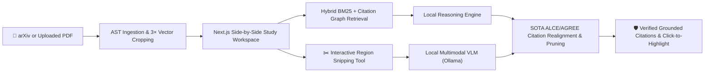

# ScholAR

<div align="center">

**A local-first, privacy-preserving research companion for reading scientific papers with inspectable visual and textual evidence.**

[](https://www.python.org/)
[](https://fastapi.tiangolo.com/)
[](https://nextjs.org/)
[](https://ollama.com/)
[](LICENSE)

[Quickstart](#quickstart) • [Hardware & Model Matrix](#hardware-matrix) • [Key Features](#features) • [Architecture](#architecture) • [Keyboard Shortcuts](#shortcuts) • [Documentation](#documentation)

</div>

---

## 🌟 Overview <a id="overview"></a>

ScholAR is an open-source, local-first research paper copilot that lets you search arXiv, upload PDFs, study complex papers side-by-side with an AI assistant, snip equations and figures for visual reasoning, and follow every generated claim back to exact bounding boxes and quotes on the real page.

All model inference runs **100% locally on your machine** via [Ollama](https://ollama.com/). Your private research papers, extracted text, and study notes never leave your computer.



---

## ⚡ Quickstart in 60 Seconds <a id="quickstart"></a>

### Automated 1-Click Setup (macOS / Linux / WSL2)

```bash
# 1. Clone the repository
git clone https://github.com/prithvi-kaizen/ScholAR.git
cd ScholAR

# 2. Run the interactive hardware-aware installer
bash scripts/quickstart.sh
```

The quickstart script will:
1. Detect your available RAM, Apple Silicon, and NVIDIA GPUs.
2. Recommend and download the optimal local model tier in Ollama.
3. Configure your Python virtual environment and frontend packages.
4. Verify your environment health with `doctor.py`.

---

## 💻 Hardware Configuration & Model Matrix <a id="hardware-matrix"></a>

ScholAR dynamically adapts its retrieval and prompting based on your machine's hardware profile. Choose the model tier that fits your setup:

| Tier | Target Machine Specs | Recommended Model | Model Size | Modality | Best For | Ollama Command |
| :--- | :--- | :--- | :--- | :--- | :--- | :--- |
| **Tier 1: Entry** | 8 GB RAM / CPU-only laptops | `qwen2.5:7b` | ~4.7 GB | Text | Fast text lookup, summaries, methodology Q&A | `ollama pull qwen2.5:7b` |
| **Tier 2: Balanced** *(Recommended)* | 16 GB RAM / Apple M1/M2/M3/M4 / RTX 3060/4060 | `qwen3.5:9b` | ~6.6 GB | Multimodal (Text + Vision) | Balanced deep paper reasoning, figure analysis, equations | `ollama pull qwen3.5:9b` |
| **Tier 3: Precision VLM** | 16 GB - 32 GB RAM / Apple Pro/Max / RTX 3080/4080 | `gemma4:12b` | ~8.5 GB | Multimodal (Text + Vision) | High-precision chart reasoning, multi-panel figure breakdown | `ollama pull gemma4:12b` |
| **Tier 4: Workstation** | 32 GB+ RAM / RTX 3090/4090 / A100 | `qwen2.5:14b` or `qwen2.5:32b` | ~9 GB - 19 GB | Text | Maximum depth, complex cross-paper synthesis, proofs | `ollama pull qwen2.5:14b` |

> 💡 **Switching Models:** You can change your active model anytime by running `python3 scripts/setup_models.py` or editing `OLLAMA_MODEL` in `backend/.env`.

---

## 🚀 Manual Step-by-Step Installation <a id="installation"></a>

<details>
<summary><b>macOS & Linux (Manual)</b></summary>

### 1. Prerequisites
- Python 3.11 or 3.12 (`python3 --version`)
- Node.js 18 or 20 LTS (`node --version`)
- [Ollama](https://ollama.com/download) installed and running

### 2. Install Backend
```bash
python3 -m venv .venv
source .venv/bin/activate
pip install --upgrade pip
pip install -r requirements.txt
cp backend/.env.example backend/.env
```

### 3. Install Frontend
```bash
cd frontend
npm ci
cp .env.example .env.local
cd ..
```

### 4. Pull Your Model & Start
```bash
# Pull model
ollama pull qwen3.5:9b

# Terminal 1: Backend
make backend

# Terminal 2: Frontend
make frontend
```
</details>

<details>
<summary><b>Windows (WSL2 / PowerShell)</b></summary>

### Windows via WSL2 (Recommended)
Open Ubuntu in WSL2 and follow the [macOS & Linux](#quickstart) steps.

### Windows Native PowerShell
```powershell
# 1. Setup Python environment
python -m venv .venv
.\.venv\Scripts\Activate.ps1
pip install --upgrade pip
pip install -r requirements.txt
Copy-Item backend\.env.example backend\.env

# 2. Setup Frontend
cd frontend
npm install
Copy-Item .env.example .env.local
cd ..

# 3. Pull Ollama model
ollama pull qwen3.5:9b

# 4. Start services
# Terminal 1:
.\.venv\Scripts\python.exe -m uvicorn backend.main:app --port 8000 --reload
# Terminal 2:
cd frontend; npm run dev
```
</details>

---

## 🎯 Key Features <a id="features"></a>

### ✂️ Interactive PDF Region Snipping Tool
- Press <kbd>S</kbd> or click **Snip Region** to activate the canvas marquee tool.
- Drag a custom box of any size over equations, proofs, sub-charts, or table slices.
- Click **"Ask ScholAR"** to send a high-res $3\times$ vector crop directly to the local multimodal model with automatic page-bounding citations.

### 🛡️ SOTA Citation Realignment & Pruning Engine
- Implements **ALCE** (Gao et al. 2023) and **AGREE** (Li et al. 2023) citation alignment.
- **Attribution Disentanglement**: Forbids tagging disclaimers or assumptions with spurious citations.
- **Negative Statement Pruning**: Automatically strips citation tags from disclaimer sentences to prevent false red contradiction badges.
- **Dynamic Pool Auto-Remapping**: Automatically maps mis-indexed model claims to the true supporting evidence passage in the paper.

### 📊 Multimodal Table & Figure Grounding
- Automatically extracts figures, captions, and subregions during PDF ingestion.
- Renders rich Markdown tables and performs row-by-row delta and trade-off analyses.
- Interactive **Sources** thumbnail cards let you click citation pills `[1]` to instantly jump to and highlight figures on the canvas.

### 📐 Pure KaTeX Mathematical Formatting
- Mathematical formulas, tensor symbols, and variables are rendered cleanly in KaTeX without ugly pseudo-LaTeX dollar-sign artifacts.

### 📚 Multi-Document Citation Graph
- Ingest and cross-reference cited papers directly from Semantic Scholar and arXiv without leaving your reading workspace.

---

## ⌨️ Keyboard Shortcuts <a id="shortcuts"></a>

| Shortcut | Context | Action |
| :--- | :--- | :--- |
| <kbd>S</kbd> | PDF Viewer | **Toggle Snip Region (Screenshot tool)** |
| <kbd>J</kbd> / <kbd>←</kbd> | PDF Viewer | Previous page |
| <kbd>K</kbd> / <kbd>→</kbd> | PDF Viewer | Next page |
| <kbd>+</kbd> / <kbd>=</kbd> | PDF Viewer | Zoom in |
| <kbd>-</kbd> | PDF Viewer | Zoom out |
| <kbd>0</kbd> | PDF Viewer | Reset zoom (100%) |
| <kbd>1</kbd> / <kbd>2</kbd> / <kbd>3</kbd> | Study Workspace | Switch tabs (Chat, Goals, References) |
| <kbd>Cmd</kbd> + <kbd>Enter</kbd> | Chat Box | Send message |
| <kbd>?</kbd> | Global | Open Keyboard Shortcuts modal |
| <kbd>Esc</kbd> | Global | Cancel selection / Close modal |

---

## 🏗️ Architecture <a id="architecture"></a>

```text
ScholAR/
├── backend/
│   ├── main.py                  # FastAPI endpoints & routing orchestrator
│   ├── services/
│   │   ├── pdf_service.py       # PyMuPDF AST extraction & 3x region cropping
│   │   ├── retrieval_service.py # BM25 + Multi-document citation graph
│   │   ├── routing_service.py   # Adaptive query router & task decomposition
│   │   ├── verifier_service.py  # SOTA ALCE/AGREE claim verification & pruning
│   │   ├── vision_service.py    # Local multimodal visual grounding (Ollama)
│   │   └── reference_service.py # arXiv & Semantic Scholar graph resolver
│   └── schemas/                 # Capability matrix & document data structures
├── frontend/
│   ├── app/                     # Next.js 15 app router & paper study pages
│   ├── components/
│   │   ├── PdfViewer.tsx        # Canvas renderer with interactive snip marquee
│   │   ├── ChatBox.tsx          # KaTeX chat with snippet attachments & sources
│   │   ├── StudyGoals.tsx       # Paper-specific study roadmaps & milestones
│   │   └── ReferencesPanel.tsx  # Interactive multi-paper citation explorer
│   └── types/                   # Shared TypeScript contracts
├── scripts/
│   ├── quickstart.sh            # 1-click interactive installation script
│   ├── setup_models.py          # Hardware auto-detection & Ollama model tiering
│   └── doctor.py                # Environment diagnostics & repair assistant
├── evaluation/                  # M3SciQA and faithfulness benchmark pipelines
└── docs/                        # Complete technical guides & architecture specs
```

---

## 🧪 Verification & Testing <a id="testing"></a>

ScholAR includes an automated test suite covering citation alignment, PyMuPDF vector cropping, routing budgets, and TypeScript type safety:

```bash
# Run unit tests
.venv/bin/python -m unittest discover -s tests

# Run frontend typecheck
cd frontend && npm run typecheck

# Run environment diagnostics
make doctor
```

---

## 📖 Documentation <a id="documentation"></a>

- [Master System Guide](docs/SCHOLAR_MASTER_GUIDE.md): Complete technical reference, RAG pipeline architecture, and benchmarks.
- [Local Setup Guide](docs/SETUP.md): First installation, hardware sizing, and troubleshooting.
- [Contributing Guide](CONTRIBUTING.md): Architectural standards, ALCE/AGREE citation methodology, and PR guidelines.
- [Experiment Ledger](docs/EXPERIMENTS.md): Empirical results and evaluation methodologies.

---

## 🔒 Privacy & Local Execution

ScholAR is built on a **local-first** security model:
- All PDF text extraction, vector rendering, and snippet crops reside strictly on your local disk (`backend/data/papers/`).
- Text and visual inference execute 100% locally through your Ollama instance.
- External network calls are strictly limited to paper discovery (arXiv search/PDF download) and metadata resolution (Semantic Scholar).

---

## 📄 License

Released under the [MIT License](LICENSE).
