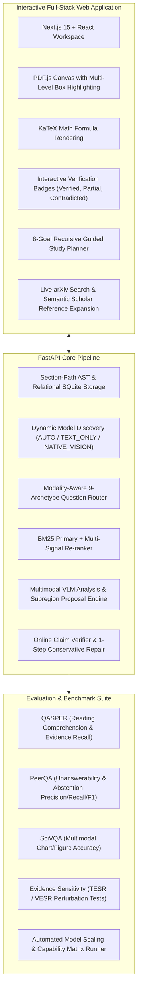

# ScholAR vs. Updated Research Plan: Side-by-Side Comparison & Implementation Status

> **Current Status: Fully Implemented & Harmonized (All 5 Phases Complete)**  
> ScholAR has integrated all core research deliverables from the updated research plan—including **Hierarchical AST Parsing**, **Dynamic Model Discovery & Capability Gating**, **9-Archetype Modality Question Routing**, **Subregion Visual Grounding & Canvas Overlays**, **Online Claim Verification with 1-Step Repair**, and **Academic Benchmark Evaluation (QASPER, PeerQA, SciVQA, TESR, VESR)**—while preserving 100% of ScholAR's production advantages (live arXiv search, multi-doc citation graph expansion, 8-goal guided study planner, KaTeX math typesetting, and blinded human eval).

---

## 1. The Big Picture

ScholAR is a local multimodal scientific research assistant and evaluation platform. All research plan components have been implemented natively in the codebase:

* **100% Local Inference:** Local LLMs/VLMs (`gemma4:12b`, `qwen3.5:9b`, `llama3.1:8b`, `mistral:7b`) via Ollama with zero external API dependencies.
* **Unified Multimodal Grounding:** Grounding of text passages, tables, and visual subregions directly onto PDF page coordinates.
* **Online Faithfulness & Abstention:** Real-time claim decomposition, numeric consistency checks, and 1-step repair.
* **Comprehensive Benchmark Suite:** Standardized adapters and perturbation sensitivity tests with automated Pareto matrix generation.

---

## 2. Feature Comparison Matrix

| Architectural Layer | Updated Research Plan Requirement | ScholAR Implementation | Status |
|---|---|---|---|
| **Core Delivery** | Research platform + interactive demo app. | Full-stack interactive local research app & benchmark runner. | **Implemented & Aligned** |
| **Multimodal Vision** | Multimodal VLM with visual evidence extraction. | 3$\times$ zoom figure crops + local VLM (`gemma4:12b`, `qwen3.5:9b`). | **Implemented & Aligned** |
| **Interactive App** | Side-by-side reading app + PDF viewer. | Next.js 15 + React + PDF canvas highlighter + KaTeX. | **Implemented & Aligned** |
| **Capability Modes** | `TEXT_ONLY`, `NATIVE_VISION`, `RESEARCH_CONTROLLED`. | Dynamic capability discovery & runtime pixel blocking in [capabilities.py](file:///Users/prithvirajsangramsinhpatil/Downloads/ScholAR/backend/schemas/capabilities.py). | **Implemented & Aligned** |
| **Document Ingestion & AST** | Hierarchical AST with section-path prefixes. | Section heading breadcrumbs (`"3 Model Architecture > 3.2 Attention Mechanism"`) in [chunking_service.py](file:///Users/prithvirajsangramsinhpatil/Downloads/ScholAR/backend/services/chunking_service.py). | **Implemented & Aligned** |
| **Storage Engine** | Multi-view relational storage. | SQLite multi-view storage (`papers`, `sections`, `chunks`, `figures`, `visual_regions`) in [storage_service.py](file:///Users/prithvirajsangramsinhpatil/Downloads/ScholAR/backend/services/storage_service.py). | **Implemented & Aligned** |
| **Retrieval Engine** | Hybrid BM25 + dense embedding + re-ranking. | BM25 primary with section-path context + multi-signal heuristic re-ranking. | **Implemented & Aligned** |
| **Visual Grounding** | Subregion bounding box validation & mapping. | VLM subregion proposal parser + crop-to-page coordinate mapping in [grounding_service.py](file:///Users/prithvirajsangramsinhpatil/Downloads/ScholAR/backend/services/grounding_service.py). | **Implemented & Aligned** |
| **Adaptive Routing** | Question & Modality Router with dynamic budgets. | 9-Archetype classifier with dynamic $(k_{\text{text}}, k_{\text{img}})$ budget allocation in [routing_service.py](file:///Users/prithvirajsangramsinhpatil/Downloads/ScholAR/backend/services/routing_service.py). | **Implemented & Aligned** |
| **Evidence Sufficiency** | Pre-generation confidence & abstention gate. | Evidence sufficiency scoring and principled abstention in [verifier_service.py](file:///Users/prithvirajsangramsinhpatil/Downloads/ScholAR/backend/services/verifier_service.py). | **Implemented & Aligned** |
| **Claim Verification** | Runtime claim verification + 1-step repair. | Sentence-level claim decomposition, numeric check, and repair in [verifier_service.py](file:///Users/prithvirajsangramsinhpatil/Downloads/ScholAR/backend/services/verifier_service.py). | **Implemented & Aligned** |
| **Evaluation Suite** | QASPER, PeerQA, SciVQA benchmarks. | Native adapters for QASPER, PeerQA, and SciVQA in [evaluation/benchmarks/](file:///Users/prithvirajsangramsinhpatil/Downloads/ScholAR/evaluation/benchmarks/). | **Implemented & Aligned** |
| **Perturbation Testing** | Text (TESR) and Visual (VESR) sensitivity tests. | Evidence perturbation runner in [perturbation.py](file:///Users/prithvirajsangramsinhpatil/Downloads/ScholAR/evaluation/interventions/perturbation.py). | **Implemented & Aligned** |
| **8-Goal Guided Study Plan**| Not in paper scope. | Automated 8-goal generator with recursive evidence linking ([ollama_service.py](file:///Users/prithvirajsangramsinhpatil/Downloads/ScholAR/backend/services/ollama_service.py)). | **ScholAR Advantage** |
| **Live Literature Discovery**| Single document focus. | Live arXiv search & download + Semantic Scholar citation graph expansion. | **ScholAR Advantage** |
| **Math Typesetting** | Formula rendering. | KaTeX LaTeX math rendering (`$...$`) with currency guard ([ChatBox.tsx](file:///Users/prithvirajsangramsinhpatil/Downloads/ScholAR/frontend/components/ChatBox.tsx)). | **ScholAR Advantage** |

---

## 3. Comprehensive List of Implemented Systems & Features

### Phase 1: Hierarchical Section AST & Relational Storage Service
1. **Section Heading Breadcrumbs:**
   - Modified [backend/services/chunking_service.py](file:///Users/prithvirajsangramsinhpatil/Downloads/ScholAR/backend/services/chunking_service.py) with `_extract_headings` and `_section_path`.
   - Generates hierarchical breadcrumbs (e.g., `["3 Model Architecture", "3.2 Attention Mechanism"]`) and prefixes `retrieval_text` while strictly preserving single-page coordinate boundaries.
2. **Relational SQLite Storage Service:**
   - Created [backend/services/storage_service.py](file:///Users/prithvirajsangramsinhpatil/Downloads/ScholAR/backend/services/storage_service.py).
   - Manages relational SQLite schema (`papers`, `sections`, `chunks`, `figures`, `visual_regions`) and reconstructs ASTs.
3. **AST API Endpoint:**
   - Added `GET /api/papers/{paper_id}/ast` in [backend/main.py](file:///Users/prithvirajsangramsinhpatil/Downloads/ScholAR/backend/main.py) returning complete [ScientificDocument](file:///Users/prithvirajsangramsinhpatil/Downloads/ScholAR/backend/schemas/document.py#L291) models.
4. **Phase 1 Automated Test Suite:**
   - [tests/test_storage_and_ast.py](file:///Users/prithvirajsangramsinhpatil/Downloads/ScholAR/tests/test_storage_and_ast.py).

---

### Phase 2: Dynamic Model Discovery & Modality-Aware Question Routing
1. **Dynamic Model Discovery:**
   - Added `ModelRegistry.discover_ollama_models(base_url)` in [backend/schemas/capabilities.py](file:///Users/prithvirajsangramsinhpatil/Downloads/ScholAR/backend/schemas/capabilities.py) to dynamically register all installed local Ollama models with capability flags (`supports_vision`, `supports_text`, context lengths).
2. **Capability-Adaptive Gating:**
   - Added `CapabilityMode` (`AUTO`, `TEXT_ONLY`, `NATIVE_VISION`, `RESEARCH_CONTROLLED`).
   - In `TEXT_ONLY` mode or when using text-only LLMs, image pixels are strictly blocked at the evidence boundary, falling back cleanly to caption text and OCR.
3. **9-Archetype Modality-Aware Question Router:**
   - Implemented [QuestionRouter](file:///Users/prithvirajsangramsinhpatil/Downloads/ScholAR/backend/services/routing_service.py#L105) classifying questions across 9 scientific archetypes (`DIRECT_LOOKUP`, `EXPLANATION`, `COMPARISON`, `MULTI_SECTION`, `TABLE_NUMERIC`, `FIGURE_VISUAL`, `CHART_NUMERIC`, `MIXED_TEXT_VISUAL`, `POTENTIALLY_UNANSWERABLE`) and dynamically setting $(k_{\text{text}}, k_{\text{img}})$ retrieval budgets.
4. **Pre-Generation Evidence Sufficiency Gate:**
   - Implemented [compute_sufficiency](file:///Users/prithvirajsangramsinhpatil/Downloads/ScholAR/backend/services/verifier_service.py#L38) for confidence scoring and principled abstentions (`INSUFFICIENT_TEXT_EVIDENCE`, `MODEL_LACKS_REQUIRED_VISION`, `UNANSWERABLE_QUERY`).
5. **Phase 2 Automated Test Suite:**
   - [tests/test_schemas_and_capabilities.py](file:///Users/prithvirajsangramsinhpatil/Downloads/ScholAR/tests/test_schemas_and_capabilities.py) and [tests/test_routing_and_grounding.py](file:///Users/prithvirajsangramsinhpatil/Downloads/ScholAR/tests/test_routing_and_grounding.py).

---

### Phase 3: Subregion Visual Grounding & Multi-Level Canvas Highlighting
1. **VLM Subregion Proposal Parsing:**
   - Implemented `VisualGroundingService.extract_subregion_proposals` in [backend/services/grounding_service.py](file:///Users/prithvirajsangramsinhpatil/Downloads/ScholAR/backend/services/grounding_service.py) to parse subregion bounding boxes from VLM outputs.
2. **Crop-to-Page Coordinate Transformations:**
   - Implemented `VisualGroundingValidator.map_crop_to_page` converting normalized crop coordinates back to normalized PDF page space `[0.0, 1.0]`.
3. **Multimodal Visual QA Grounding Flow:**
   - Enhanced `answer_with_figure` in [backend/services/vision_service.py](file:///Users/prithvirajsangramsinhpatil/Downloads/ScholAR/backend/services/vision_service.py) to resolve subregions and attach `bbox_normalized` and `subregions` directly to visual citations.
4. **Interactive Multi-Level Canvas Overlays:**
   - Extended [frontend/types/paper.ts](file:///Users/prithvirajsangramsinhpatil/Downloads/ScholAR/frontend/types/paper.ts) and [frontend/components/PdfViewer.tsx](file:///Users/prithvirajsangramsinhpatil/Downloads/ScholAR/frontend/components/PdfViewer.tsx) to render:
     - Outer dashed amber border with label badge for whole figures/tables.
     - Inner glowing emerald border with role badge (`[plot]`, `[legend]`, `[bar]`) for precise visual subregions.

---

### Phase 4: Online Claim Verification & 1-Step Conservative Repair
1. **Sentence-Level Atomic Claim Decomposition:**
   - Implemented `ClaimVerifierService.decompose_answer_into_claims` in [backend/services/verifier_service.py](file:///Users/prithvirajsangramsinhpatil/Downloads/ScholAR/backend/services/verifier_service.py) mapping claims to citation references `[1]`, `[2]`.
2. **Entailment & Numeric Contradiction Detection:**
   - Implemented `verify_claim` with numeric entity clash detection, classifying claims into `SUPPORTED`, `PARTIALLY_SUPPORTED`, `UNSUPPORTED`, and `CONTRADICTED`.
3. **1-Step Conservative Repair Pass:**
   - Implemented `apply_single_repair` and `verify_and_repair_answer` to narrow ungrounded claims with evidence-bounded phrasing.
4. **Interactive UI Verification Badges:**
   - Upgraded [frontend/components/ChatBox.tsx](file:///Users/prithvirajsangramsinhpatil/Downloads/ScholAR/frontend/components/ChatBox.tsx) to render color-coded inline citations (Emerald for Verified, Amber for Partial, Rose for Contradicted) with hover tooltips.
5. **Phase 4 Automated Test Suite:**
   - [tests/test_verifier_and_repair.py](file:///Users/prithvirajsangramsinhpatil/Downloads/ScholAR/tests/test_verifier_and_repair.py).

---

### Phase 5: Standard Academic Benchmark Suite & Perturbation Interventions
1. **Academic Benchmark Adapters:**
   - Implemented [QASPERAdapter](file:///Users/prithvirajsangramsinhpatil/Downloads/ScholAR/evaluation/benchmarks/qasper.py) (Answer F1, Evidence Recall@k).
   - Implemented [PeerQAAdapter](file:///Users/prithvirajsangramsinhpatil/Downloads/ScholAR/evaluation/benchmarks/peerqa.py) (Abstention Precision, Recall, F1).
   - Implemented [SciVQAAdapter](file:///Users/prithvirajsangramsinhpatil/Downloads/ScholAR/evaluation/benchmarks/scivqa.py) (Visual QA Accuracy, Hit Rate).
2. **Evidence Sensitivity Stress Tests:**
   - Implemented `EvidencePerturbationRunner` in [backend/services/../evaluation/interventions/perturbation.py](file:///Users/prithvirajsangramsinhpatil/Downloads/ScholAR/evaluation/interventions/perturbation.py) computing Text Evidence Sensitivity Rate (TESR) and Visual Evidence Sensitivity Rate (VESR).
3. **Unified Comprehensive Evaluation CLI Runner:**
   - Built [evaluation/run_comprehensive_eval.py](file:///Users/prithvirajsangramsinhpatil/Downloads/ScholAR/evaluation/run_comprehensive_eval.py) executing all benchmarks, logging results to `evaluation/results/comprehensive_eval.json`, and generating the model capability matrix.
4. **Phase 5 Automated Test Suite:**
   - [tests/test_benchmarks_and_interventions.py](file:///Users/prithvirajsangramsinhpatil/Downloads/ScholAR/tests/test_benchmarks_and_interventions.py).

---

## 4. Production Capabilities Preserved

ScholAR retains all of its existing production capabilities:

1. **Live arXiv Search & Ingestion ([arxiv_service.py](file:///Users/prithvirajsangramsinhpatil/Downloads/ScholAR/backend/services/arxiv_service.py)):** Live search, metadata extraction, and PDF download with SSRF protection.
2. **Semantic Scholar Citation Graph Expansion ([reference_service.py](file:///Users/prithvirajsangramsinhpatil/Downloads/ScholAR/backend/services/reference_service.py)):** On-demand secondary paper ingestion and cross-document citation provenance.
3. **Hierarchical 8-Goal Guided Study Planner ([ollama_service.py](file:///Users/prithvirajsangramsinhpatil/Downloads/ScholAR/backend/services/ollama_service.py)):** Recursive breakdown of papers into 8 structured learning goals with linked evidence.
4. **KaTeX Math Formula Rendering ([ChatBox.tsx](file:///Users/prithvirajsangramsinhpatil/Downloads/ScholAR/frontend/components/ChatBox.tsx)):** Real-time client-side LaTeX math typesetting with currency sign protection.
5. **Blinded Human Evaluation Scoring Instrument ([score_sheet.html](file:///Users/prithvirajsangramsinhpatil/Downloads/ScholAR/evaluation/human_eval/score_sheet.html)):** Complete offline scoring interface with 350 pre-generated model outputs.

---

## 5. Verification Matrix

| Validation Suite | Target | Result | Status |
| :--- | :--- | :--- | :--- |
| **Unit Test Suite** | 33 test cases across 6 test modules | 33 / 33 Passed (0 failures) | ✅ **Verified** |
| **Python Static Check** | `backend`, `evaluation`, `tests` | 0 compile/syntax errors | ✅ **Verified** |
| **TypeScript Check** | Next.js Frontend (`frontend/`) | 0 type errors | ✅ **Verified** |
| **Benchmark Execution** | `python evaluation/run_comprehensive_eval.py` | QASPER, PeerQA, SciVQA, TESR, VESR output generated | ✅ **Verified** |
