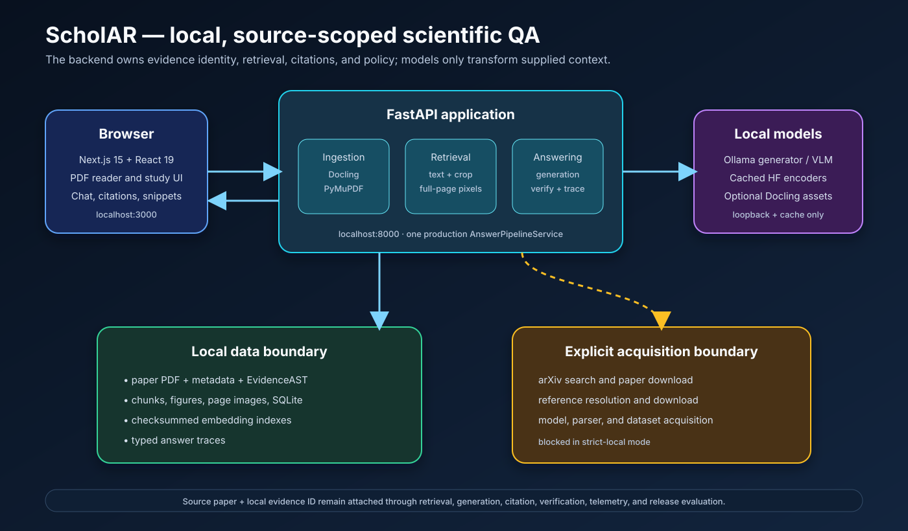

# ScholAR codebase guide

This file describes the repository from the code that currently runs. The algorithmic
flow is explained in [PIPELINE.md](PIPELINE.md), and installation is in
[SETUP.md](SETUP.md).



## Runtime shape

ScholAR uses three processes:

1. Next.js on `localhost:3000` renders the browser interface.
2. FastAPI on `localhost:8000` owns ingestion, retrieval, citations, verification,
   storage, and network policy.
3. Ollama on `localhost:11434` optionally generates text and visual answers.

The browser never decides which evidence is correct. Ollama never owns page numbers or
evidence identity. Those remain application-owned from ingestion to the final trace.

## Directory map

| Directory | Purpose |
|---|---|
| `backend/main.py` | FastAPI app, request validation, HTTP and SSE endpoints |
| `backend/schemas/` | Pydantic contracts for evidence, reasoning, traces, and models |
| `backend/services/` | Production parsing, retrieval, generation, and verification |
| `backend/data/` | Ignored local papers, indexes, snippets, and answer traces |
| `frontend/app/` | Next.js App Router pages |
| `frontend/components/` | PDF, chat, study, evidence, and navigation components |
| `frontend/lib/`, `frontend/types/` | Browser helpers and API types |
| `evaluation/` | Current datasets, runners, human-study, scoring, and release code |
| `paper/eacl_industry/` | The only retained manuscript source |
| `requirements/` | Direct dependency layers and Python 3.12 locks |
| `scripts/` | Setup, diagnosis, ingestion, and visual-artifact migration |
| `tests/` | Runtime, storage, pipeline, evaluation, and release regressions |
| `docs/` | The maintained codebase, pipeline, setup, and SVG files |

Virtual environments, `node_modules`, `.env` files, prepared papers, model caches,
generated results, and build directories are local state rather than project source.

## Backend API

`backend/main.py` creates the app and groups endpoints as follows:

| Area | Main endpoints |
|---|---|
| System | `/health`, `/api/system/network-policy`, `/api/system/health-diagnostic`, `/api/models` |
| Papers | arXiv search/prepare, local upload, metadata, AST, figures, PDF, rendered pages |
| References | list, resolve, and explicitly ingest a reference |
| Study | snippets, study goals, reasoning export |
| Retrieval | `/api/retrieval/search` |
| Reasoning | query analysis and cross-document reasoning |
| Answers | `/api/papers/{paper_id}/chat` and `/chat/stream` |
| Audit | `/api/telemetry/traces` |

Both chat endpoints create the same `AnswerPipelineRequest` and call
`AnswerPipelineService.answer`. The SSE route reports the completed pipeline stages; it
does not maintain a second answer implementation.

## Schemas

| File | Owns |
|---|---|
| `answer_trace.py` | request controls, per-channel retrieval, citations, generation, verification, timings, abstention, final `AnswerTrace` |
| `capabilities.py` | model modality, capability modes, hardware tiers and evidence budgets |
| `claims.py` | atomic claims, citation spans, support labels and repair records |
| `document.py` | reconstructed document and geometric storage types |
| `evidence.py` | canonical `EvidenceAST`, blocks, tables, sections, parser configurations |
| `evidence_graph.py` | evidence graph and ordered reasoning path |
| `numeric_plan.py` | deterministic numeric operations and results |
| `reasoning.py` | L1-L5 analysis, target modalities, and subqueries |
| `visual_document.py` | source-scoped page/figure/table images with checksums and boxes |

`AnswerTrace` is the central execution contract. API responses, telemetry, and release
evaluation all derive from the production trace.

## Production services

### Acquisition, parsing, and storage

| Service | Responsibility |
|---|---|
| `network_policy_service.py` | Separates explicit external acquisition from strict-local analysis |
| `arxiv_service.py` | Policy-gated arXiv search |
| `reference_service.py` | Reference extraction, resolution, and ingestion |
| `pdf_service.py` | Safe download, text extraction, page/crop rendering, snippets, atomic files |
| `docling_service.py` | Optional Docling semantic parse with local assets |
| `ingestion_service.py` | Builds the AST, chunks, figures, pages, visual units, and metadata |
| `paper_finalize_service.py` | Stages, validates, manifests, and atomically publishes a paper bundle |
| `storage_service.py` | Maintains the SQLite query view |
| `chunking_service.py` | Legacy page chunking and figure-chunk compatibility |

### Retrieval and reasoning

| Service | Responsibility |
|---|---|
| `dense_embedding_service.py` | Local text embeddings, exact vector search, deterministic fallback, cache validation |
| `visual_embedding_service.py` | Paired query/crop CLIP embeddings and crop index |
| `visual_page_retrieval_service.py` | Legacy CLIP page tiling, patch-token index, and MaxSim baseline |
| `colqwen_visual_retrieval_service.py` | Document-trained ColQwen2 page index, MaxSim, and candidate regions |
| `document_visual_retrieval_service.py` | Configured backend selection and explicit fallback reporting |
| `retrieval_service.py` | BM25, dense, modality, crop-image, page-image, RRF, and result fusion |
| `reranker_service.py` | Local cross-encoder or deterministic fallback reranking |
| `question_analyzer.py` | L1-L5 classification and bounded subqueries |
| `routing_service.py` | Ten question routes and modality/top-k budgets |
| `budgeting_service.py` | 8/16/32+ GB evidence budgets and graph pruning |
| `evidence_graph_service.py` | Evidence graph and reasoning path |
| `table_arithmetic_service.py` | Deterministic table extraction and arithmetic |
| `multi_hop_service.py` | Parallel multi-hop helpers |
| `cross_document_reasoning_service.py` | Cross-paper reasoning endpoint |
| `grounding_service.py` | Validates visual subregions and maps crop boxes to pages |

### Generation and audit

| Service | Responsibility |
|---|---|
| `ollama_service.py` | Loopback model discovery, generation, seeds, decoding, and model metadata |
| `vision_service.py` | Safe image loading and two-pass local visual answering |
| `verifier_service.py` | Evidence sufficiency, claim labels, citation remap, repair, and abstention |
| `answer_pipeline.py` | The single end-to-end production answer path |
| `telemetry_service.py` | Atomic persistence of typed traces |
| `diagnostic_service.py` | Acceleration, memory, and local-cache status |
| `export_service.py` | Reasoning export for API/UI |

## Frontend

The frontend uses Next.js 15, React 19, TypeScript, Tailwind CSS, KaTeX, and Lucide.

| Route | Purpose |
|---|---|
| `/` | Search, local upload, and prepared-paper entry |
| `/paper/[id]` | PDF viewer, study panel, chat, citations, snippets, and references |
| `/compare` | Cross-paper comparison |
| `/benchmark` | Evaluation artifact inspection |
| `/telemetry` | Answer-trace inspection |

`StudyWorkspace` composes the paper page. `PdfViewer` renders pages and highlights;
`ChatBox` calls chat/SSE and displays citations; `ReferencesPanel`, `StudyGoals`,
`EvidenceGraphModal`, and `PaperModal` expose corresponding backend features.

## Local paper layout

```text
backend/data/papers/{paper_id}/
├── paper.pdf
├── metadata.json
├── ingestion_manifest.json
├── evidence_ast.json
├── pages.json
├── chunks.json
├── figures.json
├── visual_units.json
├── document.db
├── figures/*.png
├── page_images/*.png
├── snippets/*.png
├── embeddings.npy
├── embeddings_manifest.json
├── visual_embeddings.npy
├── visual_embeddings_manifest.json
├── visual_page_embeddings.npy
├── visual_page_embeddings_manifest.json
├── colqwen_page_vectors.npy
├── colqwen_page_offsets.npy
├── colqwen_page_metadata.json
└── colqwen_page_manifest.json
```

Embedding files are lazy. Their manifests bind vectors to inputs, encoder identity,
shape, dtype, and checksums. Corrupt or stale caches rebuild rather than mixing spaces.
Answer traces are separate under `backend/data/traces/`.

`PaperFinalizeService` builds a sibling staging directory and validates required files,
counts, source identity, unique IDs, safe image paths, checksums, and database rows before
renaming it into place. Readers should never see a half-built generation.

## Evaluation and paper boundaries

Production code does not read historical result reports. Current runners write disposable
outputs to ignored `evaluation/results/`. Release-quality evidence uses a versioned raw →
scored → aggregate → table → validation lifecycle under `evaluation/releases/`.

The EACL manuscript uses release-derived material only. `claim_map.json` links system
claims to current code, while validation rejects pending empirical gates and legacy paths.

## Dependency layers

- `requirements/locks/base-py312.txt`: API, PDF, storage, and base runtime.
- `requirements/locks/parser-py312.txt`: optional Docling packages.
- `requirements/locks/evaluation-py312.txt`: optional encoder/evaluation stack.
- `frontend/package-lock.json`: exact npm graph.

Ollama models, Hugging Face snapshots, Docling assets, datasets, and papers are external
assets and are deliberately not hidden in normal package installation.

## Invariants

1. A source paper and local evidence ID travel together through every channel.
2. Pages and image paths come from stored artifacts, never model prose.
3. Visual retrieval runs without requiring words such as “figure”; a similarity hit is
   an inspection candidate, not proof.
4. Missing models or encoders produce explicit fallback/abstention state. Measured runs
   fail closed when required assets are missing.
5. Acquisition is policy-gated before external access.
6. Chat, streaming, telemetry, and release evaluation share one answer pipeline.
7. Papers, caches, traces, generated results, and evaluator exports remain uncommitted.

## Where changes belong

| Change | Location |
|---|---|
| API field | backend schema + endpoint + TypeScript type + test |
| Retrieval channel | channel service + retrieval fusion + trace + tests |
| New paper artifact | schema + ingestion + finalizer + migration + tests |
| Generation behavior | `answer_pipeline.py` or `vision_service.py` |
| Verification policy | `verifier_service.py` and repair tests |
| Experiment | `evaluation/`, explicit profile, ignored output |
| Manuscript result | validated release artifact and claim map |
| Pipeline behavior | code, test, `PIPELINE.md`, and matching SVG |
