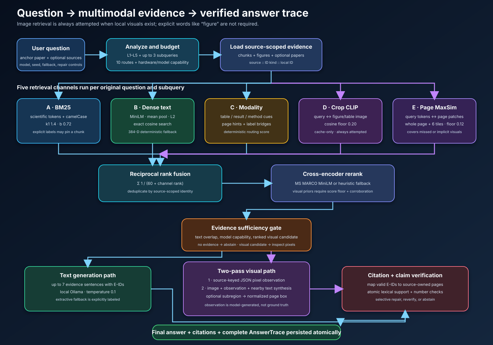
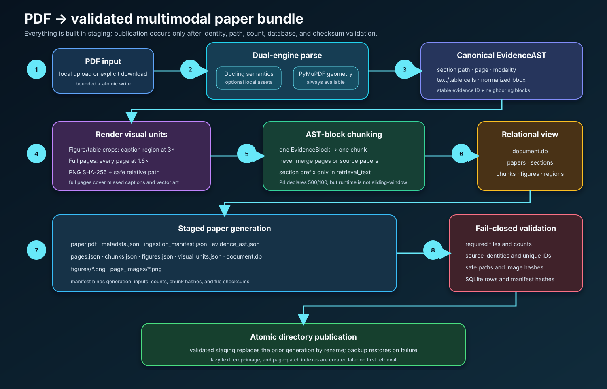

# ScholAR pipeline, end to end

This guide explains the production pipeline in simple terms while keeping the exact
models, thresholds, fallbacks, and data boundaries visible.



ScholAR has two flows: ingestion turns a PDF into source-scoped multimodal evidence;
answering retrieves that evidence, optionally inspects pixels, generates an answer,
verifies its claims, and saves a complete trace.

## Models used

| Job | Default model | Method | Missing-model behavior |
|---|---|---|---|
| Answer generation | Ollama `qwen3.5:9b` | Local text generation; receives images when capability allows | Extractive fallback or error, depending on request policy |
| Text embeddings | `sentence-transformers/all-MiniLM-L6-v2` | Mean-pooled, normalized transformer features | Deterministic 384-D signed feature hash |
| Crop image retrieval | `openai/clip-vit-base-patch32` | Normalized CLIP text/image features | Channel reports unavailable and returns no hits |
| Full-page retrieval | same CLIP model | Query-token to page-patch MaxSim | Channel reports unavailable and returns no hits |
| Reranking | `cross-encoder/ms-marco-MiniLM-L-6-v2` | Joint query/candidate classification | Deterministic lexical/RRF heuristic |
| PDF semantics | Docling | Structured sections, tables, figures, reading order | PyMuPDF heuristic parser |
| Claim verification | no learned model | Lexical overlap and number consistency | Always available |

The generation model is configurable. The capability registry recognizes common Qwen
vision, Gemma 4, LLaVA, MiniCPM-V, Llama Vision, Mistral Large 3, and Pixtral identifiers.
Unknown tags are treated as text-only unless explicitly registered.

## Ingestion



### 1. PDF input

A PDF enters through local upload or explicit remote preparation. In strict-local mode,
upload and analysis are allowed, while arXiv search/download and reference acquisition are
rejected before network setup. Remote downloads validate every redirect host, cap the PDF
at 50 MB, and publish the bytes atomically.

### 2. Dual-engine parsing

The default parser configuration is P4, the provenance AST path:

- PyMuPDF always establishes page count, page coordinates, extracted text, and rendering.
- Docling is attempted when installed. In strict-local mode it also requires a valid
  `DOCLING_ARTIFACTS_PATH`, so it cannot fetch assets during a query.

Docling supplies reading order, section hierarchy, paragraphs, tables with cell grids,
figures, pages, and boxes. If it cannot run, PyMuPDF iterates page text blocks, recognizes
short heading-like lines, and classifies simple table-like blocks. The bundle records
`parser_engine=pymupdf_heuristic` and `degraded_mode=true` for this P4 fallback.

### 3. Visual extraction

Two representations are stored:

- Figure/table crops are found from caption patterns such as `Figure 2` and `Table 3`.
  The region above and slightly below the caption is rendered at 3×. If geometry cannot
  be located, the full page is used. The cap is 80 crops per paper.
- Every full page is rendered at 1.6× into `page_images/`. This captures diagrams missed
  by captions, vector graphics, multi-panel layouts, and tables whose useful information
  exists only in pixels.

Each `VisualDocumentUnit` stores source paper, page, type, safe relative PNG path,
SHA-256, pixel dimensions, and normalized bounding box.

### 4. Chunking strategy

The actual production strategy is **one EvidenceAST block per retrieval chunk**:

- chunks never merge across a page, section block, or source paper;
- original block text is preserved;
- `retrieval_text` prepends the section path;
- every chunk keeps source/document ID, page, evidence ID, section path, modality,
  normalized box, character offsets, and figure fields;
- tables remain table chunks and visuals become figure chunks.

The P4 configuration declares a 500-token target with 100-token overlap, but the current
`_generate_chunks_from_ast` does not apply a token sliding window. The semantic parser
block is the real boundary. This is important for reproducibility.

`chunk_pages()` is only a compatibility path for older bundles. It uses 1,400-word
page-local windows with 120-word overlap and never crosses a page.

### 5. Atomic paper publication

`PaperFinalizeService` builds all artifacts in a sibling staging directory, creates the
SQLite view and checksum manifest, validates the whole generation, then swaps it into
place by directory rename. It checks files, counts, source identity, unique IDs, image
paths/hashes, database rows, and manifest hashes. The prior generation is restored if the
swap fails.

### Persisted paper bundle

| Artifact | Content |
|---|---|
| `paper.pdf` | local source PDF |
| `metadata.json` | normalized metadata, counts, parser and fallback state |
| `ingestion_manifest.json` | generation ID, schema, counts and checksums |
| `evidence_ast.json` | canonical typed blocks and sections |
| `pages.json` | normalized extracted text per page |
| `chunks.json` | AST-block retrieval records |
| `figures.json` | crop metadata |
| `visual_units.json` | canonical crop and full-page visual records |
| `document.db` | relational query view |
| `figures/`, `page_images/` | source-scoped images |

The three embedding indexes are created lazily during retrieval.

## Answering

### 1. Request and capabilities

Both chat endpoints build an `AnswerPipelineRequest` containing the paper, query,
optional secondary papers, model, capability mode, seed, decoding settings, fallback
policy, repair policy, and optional snippet/evaluation identity.

The pipeline records the Git state, model capability, route, hardware budget, and version
identifiers before generation begins.

### 2. Analyze and route

`QuestionAnalyzer` assigns L1 direct lookup, L2 same-section explanation, L3
cross-section, L4 cross-modal, or L5 multi-hop. Complex levels create at most three
targeted subqueries for method, ablation, result, text, table, or figure evidence.

`QuestionRouter` independently chooses one of ten operational routes: lookup,
explanation, comparison, multi-section, table numeric, figure visual, chart numeric,
mixed visual, code/algorithm, or potentially unanswerable. The route controls text top-k,
visual count, rounds, decomposition, and numeric execution.

Evidence budgets are based on RAM:

| RAM tier | Blocks | Tables | Visuals | Context budget |
|---|---:|---:|---:|---:|
| below 12 GB | 4 | 1 | 0 | 2,048 |
| 12–24 GB | 6 | 2 | 1 | 4,096 |
| 24 GB+ | 10 | 4 | 3 | 8,192 |

`SCHOLAR_HARDWARE_TIER` can override detection. Text-only models receive zero pixel
budget and additional text candidates for routes that would otherwise require vision.

### 3. Source identity

Anchor chunks are enriched with figure records; optional secondary papers keep their own
`source_paper_id`. Fusion identity is:

```text
source_id :: (chunk_id | evidence_id | content_sha256) :: local_id
```

This prevents two papers' `chunk_001` records from colliding.

### 4. Five retrieval channels

All available channels run for every original query and generated subquery. In particular,
the visual channels do not wait for the words “figure”, “image”, or “visual”. This is the
mechanism that answers implicit visual questions.

#### A. BM25

The tokenizer keeps scientific alphanumeric, underscore, and hyphenated tokens, adds
camelCase parts, and removes a small stop list. Okapi BM25 uses `k1=1.4` and `b=0.72`.
An explicit `Figure N` or `Table N` can pin the matching chunk.

#### B. Dense text embeddings

Chunks are embedded as `section: text`. The MiniLM tokenizer pads/truncates at 512 tokens.
The service attention-mask mean-pools the last hidden states and L2-normalizes them. The
query is encoded the same way, and NumPy dot product performs exact cosine search.

If the transformer cannot load or infer, every vector switches to a versioned 384-D
SHA-256 feature space: each lowercased word contributes weight 1.0, each character trigram
weight 0.5, then the vector is L2-normalized. It is deterministic, but not equivalent to
MiniLM.

#### C. Modality and section scoring

Rules boost method/result/table/figure chunks based on query patterns, page hints,
comparison language, and figure labels mentioned by leading text evidence. This channel
helps route evidence; it is not a support probability.

#### D. Crop-image embeddings

The CLIP processor maps the query and every safe figure/table crop to the same normalized
space using `get_text_features` and `get_image_features`. Dot-product cosine ranks images.
Only scores at or above `SCHOLAR_VISUAL_MIN_SIMILARITY` (default `0.20`) enter fusion.

The model is cache-only during user queries. Missing weights, unsafe paths, invalid images,
encoder errors, or cache mismatch produce explicit status and no crop hits.

#### E. Full-page document-visual MaxSim

`SCHOLAR_VISUAL_PAGE_BACKEND=auto` first attempts the cache-only, document-trained
ColQwen2 retriever. ColQwen2 preserves page aspect ratio and produces a variable number
of normalized vectors for each rendered page. The cache therefore uses a flat float16
matrix plus per-page offsets. Standard late interaction scores each page:

```text
score(page) = sum over query tokens(max similarity to any page token)
```

The strongest query-to-image token matches are mapped back to the model's patch grid,
clustered, expanded for context, and recorded as normalized candidate regions. For a
full-page hit the vision model inspects the highest-ranked valid crop first. The trace
retains the full page identity, crop box, backend, model, index size, and latency.

The ColQwen2 score is not a cosine probability. Its default floor is deliberately
permissive until frozen on a paper-disjoint development set. It authorizes retrieval and
pixel inspection only; it never establishes support by itself.

#### F. Legacy CLIP full-page baseline

Every page is split into seven views: the full page plus overlapping two-column by
three-row tiles. CLIP vision patch tokens are projected, normalized, flattened, and stored
as float16. Query text tokens are projected separately; start/end tokens are removed.

For each page:

```text
score(page) = mean over query tokens(max cosine to any patch on that page)
```

Only scores at or above `SCHOLAR_VISUAL_PAGE_MIN_SIMILARITY` (default `0.12`) survive. A
hit becomes a virtual `page_visual` chunk carrying the page PNG and up to 6,000 characters
of extracted page text.

### Image embedding analysis in plain language

The system asks two different visual questions:

1. **Which extracted crop looks most related to this whole query?** Crop CLIP represents
   each query and image as one vector. It is cheap and good when extraction found the
   correct figure/table.
2. **Which full page contains local evidence related to individual query words?** The
   primary ColQwen2 backend is trained for document-page retrieval and retains local
   token detail. The CLIP page implementation remains a reproducible baseline/fallback.

No embedding score proves the answer. A visual hit crossing its floor is allowed into
retrieval and may trigger pixel inspection. It gets a reranking boost only when text or
same-page evidence corroborates it. An uncorroborated hit remains an inspection candidate,
not sufficient evidence.

### 5. Fusion and reranking

Available channel ranks use reciprocal rank fusion:

```text
RRF(candidate) = Σ 1 / (60 + rank in each channel)
```

The top `max(6 × requested limit, 25)` fused candidates are sent to the cross-encoder,
which jointly tokenizes query and candidate at 512 tokens. Crop visual prior is bounded at
0.12 and page prior at 0.10; both require threshold qualification and corroboration. A
text-to-figure label bridge can add 0.35.

If a qualified visual is absent from the reranked top-k, one bounded inspection candidate
may replace the final slot. Multi-subquery results are deduplicated by global identity,
while every contributing query and channel score remains in the trace.

### 6. Sufficiency gate

No retrieved evidence causes immediate abstention. Very low overlap between query and top
text also abstains, except when a top-three visual candidate can be inspected by a
vision-capable model. That state is `VISUAL_INSPECTION_REQUIRED`, not “supported”. If pixel
inspection fails, the pipeline abstains later.

### 7. Context and reasoning artifacts

The first two anchor chunks and retrieved hits are deduplicated; the first four context
chunks currently feed the text prompt. Up to seven sentence-level evidence items are
selected using query overlap, contribution/result cues, numbers, and retrieval order.
Temporary IDs `E1`, `E2`, and so on are assigned, while the trace retains the original
source, chunk, page, quote, and content hash.

An evidence graph and reasoning path are built in parallel and pruned to hardware budget,
prioritizing method, ablation, and final-result roles. Arithmetic questions can create a
deterministic table-difference plan. These are audit artifacts; retrieval evidence remains
the grounding source.

### 8. Generation path choice

The visual path is chosen when retrieved images exist, the model accepts images, hardware
permits them, and ranked image evidence, a visual route, a leading visual result, or a
comparison/table/chart route justifies inspection. Because ranked visual evidence can make
this decision, a user does not need to mention a figure explicitly.

#### Two-pass visual generation

1. Safe source-relative crops/full pages are sent to Ollama for strict JSON observations
   keyed by visual evidence ID.
2. Images are sent again with those observations, captions, source labels, nearby text,
   and the question for answer synthesis.

The observation is labeled `visual_observation_model_generated`; it is not independent
ground truth. Optional model-proposed subregion boxes are validated in crop space and
mapped back to normalized page coordinates. User snippets bypass document retrieval but
retain paper, page, image, citation, verification, and trace provenance.

#### Text generation

The text prompt includes route instructions, source labels, bounded evidence, and the
question. Defaults are temperature `0.1`, top-p `0.9`, context `16,000`, and maximum output
`1,650`. Ollama metadata records resolved tag, digest, quantization, token counts, timings,
and actual options.

If Ollama is unavailable and fallback is allowed, the service returns up to six extracted
high-signal sentences with pages. `REQUIRE_LOCAL_MODEL` turns the same situation into an
error so measured runs cannot silently change condition.

### 9. Citation normalization and claim verification

The model may cite only supplied `E#` IDs. The application removes direct model-written
page markers, maps valid IDs to numbered citations, drops invented IDs, and attaches the
stored source/page/chunk/quote. If no valid ID is emitted, the current fallback attaches
the first two prompt evidence items and records origin `APPLICATION_IMPUTED`.

The verifier splits the answer into atomic claims and applies these transparent rules:

- overlap at least `0.50`: supported;
- overlap from `0.25` to below `0.50`: partial;
- lower overlap: unsupported;
- a claim number absent from otherwise matching evidence: contradicted.

Default selective repair may remap citations or remove/narrow unsupported text, then
reverify. If no supported factual claims remain, the answer abstains. This verifier is a
lexical baseline, not a calibrated semantic entailment model.

### 10. Final trace

`AnswerTrace` records request controls, Git identity, capabilities, analysis, subqueries,
all retrieval scores and ranks, shown evidence, graph/path, numeric plan, prompt hash,
generation identity, raw/normalized/final answer, citation origin, verification edits,
abstention/error state, and stage timings. It is written atomically under
`backend/data/traces/` and returned to the API/release runner.

## Cache integrity

Text, crop, and page indexes use separate `.npy` files and JSON manifests. Each manifest
binds vectors to input hashes, algorithm version, encoder fingerprint, shape, dtype, and
vector-file SHA-256. The vector is published first and the manifest last. Thread and
interprocess locks prevent competing builds; invalid caches rebuild.

## Current heuristic boundaries

- PyMuPDF heading/table fallback is heuristic.
- P4 runtime chunks are semantic blocks, not 500-token sliding windows.
- Visual floors `0.20` and `0.12` are routing guards, not probabilities.
- Modality routing and hardware budgets use fixed rules.
- Table arithmetic uses simple extraction/entity selection.
- Claim verification may miss paraphrase or nuanced contradiction.
- A model-generated visual observation is not source truth.
- An imputed citation guarantees provenance to shown evidence, not entailment.

These limits are why every fallback is traced and release evaluation has held-out,
human, ethics, model, hardware, and provenance gates.
