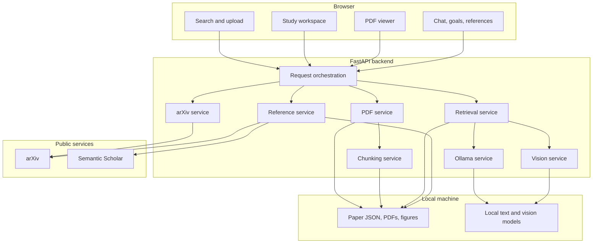

# ScholAR Project Guide

This is the canonical handoff for anyone joining ScholAR. It explains what the project is trying to do, what is actually implemented, how information moves through the system, what the experiments proved, what they disproved, and what work remains. If this is your first checkout, complete [SETUP.md](SETUP.md) first. Read this document before changing the retrieval pipeline, citation format, evaluation logic, or research claims.

## 1. The project in plain language

ScholAR is a local-first reading environment for scientific PDFs. The reader sees the paper and the assistant together. They can search arXiv, upload a PDF, generate a study plan, ask questions, inspect quoted evidence, jump to a cited page, ask about a figure or table, and load selected papers from the bibliography.

The system was built because paper reading has two related problems:

1. **Comprehension:** methods, assumptions, experiments, and limitations are hard to connect.
2. **Trust:** an answer can sound good without being supported by the paper.

ScholAR addresses the first problem with a guided workspace and the second with explicit evidence provenance. It does not fully solve faithfulness. Current experiments show that a model can cite a real retrieved page and still attach that page to an unsupported claim.

That distinction is the central thing a new contributor must understand:

> ScholAR currently guarantees citation provenance, not claim faithfulness.

The backend controls the mapping from an evidence identifier to a paper, page, chunk, and quote. The model cannot invent that mapping. The model can still choose the wrong evidence identifier or make a claim that the evidence only partially supports.

## 2. Current project state

### Implemented and usable

- arXiv search and paper preparation
- custom PDF upload
- local PDF storage and page-wise text extraction
- page-preserving text chunks
- figure and table extraction
- BM25-primary retrieval with small heuristic signals
- evidence-ID citation normalization
- local text and vision generation through Ollama
- fallback study goals and extractive answers when the local model is unavailable
- PDF rendering and quote highlighting
- multi-document reference resolution and ingestion
- a split-screen Next.js study experience
- automated evaluation scripts and committed results
- a venue-neutral manuscript draft
- a complete human-evaluation instrument and 350 generated answers

### Implemented but not yet validated strongly enough

- answer faithfulness under the current generation prompt
- exact citation highlighting across difficult PDFs
- visual answer correctness beyond routing and localization proxies
- multi-document reasoning after reference localization
- study-goal usefulness
- model-agnostic grounding as a positive research claim

### Not complete

- expert human annotation
- inter-annotator agreement and human-versus-judge correlation
- a claim-support repair loop
- repeated generation runs across random seeds
- production security, authentication, multi-user isolation, or deployment
- venue selection and venue-specific paper formatting

## 3. The reader experience, step by step

### Flow A: study an arXiv paper

1. The reader enters a search query on the home page.
2. `GET /api/search` calls the arXiv Atom API, applies local cleanup and reranking, and returns paper cards.
3. The reader opens a paper and selects **Study with AI**.
4. `POST /api/papers/prepare` creates a safe local identifier, downloads the PDF, extracts pages, creates chunks, extracts figures, and writes metadata.
5. The browser opens `/paper/{id}`.
6. The study workspace loads metadata and rendered page images from the backend.
7. The study panel loads cached goals or asks the local model to generate paper-specific goals.
8. The reader asks a question.
9. The backend retrieves evidence, routes text or visual questions, calls the selected local model, normalizes citations, and returns the answer plus source metadata.
10. Selecting a citation moves the PDF viewer to the stored page and attempts to highlight the stored quote.

### Flow B: study a private or local PDF

1. The reader selects a PDF from the home page.
2. `POST /api/papers/upload` validates the extension, 50 MB limit, and `%PDF` header.
3. A SHA-1 content digest becomes the stable local identifier. Uploading the same bytes reuses the same paper directory.
4. Metadata is inferred from the first pages when possible.
5. Extraction, chunking, figure handling, study goals, chat, and references then use the same path as an arXiv paper.

### Flow C: ask across cited papers

1. The References tab calls `GET /api/papers/{id}/references`.
2. For arXiv papers, Semantic Scholar resolves the bibliography by identifier. For uploads, title search is used and is less reliable.
3. The reader chooses an open-access reference to ingest.
4. The backend downloads and prepares it under its own local identifier.
5. The frontend passes selected secondary paper identifiers with later chat requests.
6. The backend merges anchor and secondary chunks. Every chunk carries `source_paper_id` so equal chunk IDs from different papers are not confused.
7. The returned citations identify which paper supplied the evidence.

## 4. System architecture



The architecture is deliberately file-based and monolithic at the API boundary. This is appropriate for a single-user research prototype because every intermediate artifact is visible and easy to inspect. It is not appropriate for concurrent multi-user deployment without further work.

## 5. Backend responsibilities

`backend/main.py` is the orchestration layer. It defines request schemas, API routes, evidence construction, model prompts, citation normalization, and fallback responses. It is large because the project grew experimentally. New work should prefer moving cohesive logic into `backend/services/` rather than growing this file further.

| Module | Responsibility | Important behavior |
|---|---|---|
| `arxiv_service.py` | arXiv search, parsing, caching, and reranking | Uses a polite request interval and falls back to prepared local papers when possible |
| `pdf_service.py` | safe identifiers, downloads, text extraction, figure extraction, metadata inference, page rendering, highlighting | Validates remote fetch targets and keeps text page boundaries |
| `chunking_service.py` | text and figure chunk creation | Text chunks never cross a page; figure chunks enter the same retrieval pool |
| `retrieval_service.py` | tokenization, BM25, query expansion, page and section hints, figure pinning | BM25 is primary; hashed semantic overlap is only a small reranker |
| `ollama_service.py` | local model availability, generation, study goals, deterministic fallback goals | Supports per-request model override and prompt versioned goal caches |
| `vision_service.py` | figure/table prompting and visual answer construction | Falls back to caption-only context if the image or model path fails |
| `reference_service.py` | Semantic Scholar lookup, title fallback, bibliography caching, ingestion status | Uploaded-paper resolution is inherently noisier than identifier lookup |

### Why page-preserving chunks exist

`chunk_pages()` processes one PDF page at a time. A chunk therefore always has a single `page` value. The default window is 1,400 words with 120 words of overlap, but typical scientific pages are shorter, so the observed corpus is close to one chunk per page.

This makes page lookup deterministic. It should not be described as a novel faithfulness mechanism. At current parameters, its practical value is localization and inspectability.

### How retrieval works

The production retriever follows this sequence:

1. Tokenize the question, preserving extra tokens for camel-case names such as `FlashAttention`.
2. Detect explicit `Figure N` or `Table N` references before ordinary token scoring.
3. Compute BM25 over all text and figure chunks.
4. Keep an expanded candidate window.
5. Add small reranking signals for query expansion, exact overlap, hashed semantic overlap, page hints, section hints, and research phrases.
6. Multiply figure scores when the question contains visual language.
7. Pin an explicitly named figure or table to rank one when an exact label exists.
8. Return the requested top chunks.

The 100-case benchmark shows no aggregate benefit from the heuristic layers over plain BM25. Keep them only when they improve robustness on explicit user intent, and test any weight change against both the hand-labeled and scaled sets.

### How citation normalization works

The most important trust boundary is between generation and citation rendering:

1. The backend selects strong sentences from retrieved chunks.
2. Each evidence item receives a temporary identifier such as `E1`.
3. The prompt permits citations only in that identifier vocabulary.
4. The local model writes an answer containing identifiers.
5. The backend accepts only identifiers that were actually supplied.
6. It rewrites valid identifiers to compact numeric citations.
7. Each citation response includes its page, quote, chunk ID, section, and source paper.

This prevents invented page numbers. It does not prove that the quoted evidence entails the nearby claim. The next research iteration should add a claim-to-evidence verification and repair stage here.

### Text versus vision routing

Figure and table metadata are converted into retrieval-compatible chunks. If the top retrieved chunk is a figure chunk, the chat route calls `answer_with_figure()` with the image and supporting text chunks. If the image cannot be loaded or the multimodal model is unavailable, the service answers from the caption and marks the response as a fallback.

Visual routing is currently based on the top retrieved item. A strong future change would make routing explicit and testable instead of relying on a rank-one side effect.

### Model failure behavior

The application is designed to remain inspectable when Ollama fails:

- `/health` reports whether Ollama is reachable.
- study goals return deterministic fallback goals;
- chat returns a structured error on model timeout or model failure;
- if Ollama is unavailable, chat can build an extractive answer from retrieved sentences;
- visual questions can fall back to captions.

Fallback responses must remain visibly labeled. They should never be mixed into evaluation results as ordinary model outputs.

## 6. Local data model

Prepared papers live under:

```text
backend/data/papers/{paper_id}/
├── paper.pdf
├── metadata.json
├── pages.json
├── chunks.json
├── figures.json
├── figures/
│   └── {figure_id}.png
├── references.json
└── goals_canonical_{prompt_version}.json
```

Not every paper has every file. References and goals are created lazily. Figure files exist only when extraction found usable visual regions.

### Core records

`metadata.json` contains the paper identity, title, authors, summary, source, and acquisition URLs.

`pages.json` is a list of page records with one-based page numbers and extracted text.

`chunks.json` is a list of retrieval units. Important fields are:

```json
{
  "chunk_id": "chunk_001",
  "page": 1,
  "text": "...",
  "paragraph_text": "...",
  "section_title": "Abstract",
  "chunk_type": "abstract",
  "char_start": 0,
  "char_end": 1024,
  "source_paper_id": "optional-in-single-document-mode"
}
```

Figure chunks additionally contain `is_figure_chunk`, `figure_id`, `label`, `image_file`, `bbox`, and `caption`.

This directory is private runtime state and is Git-ignored. Evaluation cases are committed, but copyrighted paper PDFs and local extracted corpora are not.

## 7. API reference

| Method | Route | Purpose |
|---|---|---|
| `GET` | `/health` | Backend and Ollama status |
| `GET` | `/api/search` | Search arXiv papers |
| `POST` | `/api/papers/prepare` | Download and prepare an arXiv paper |
| `POST` | `/api/papers/upload` | Validate and prepare an uploaded PDF |
| `GET` | `/api/papers/{id}` | Paper metadata and prepared counts |
| `GET` | `/api/papers/{id}/pdf` | Original local PDF |
| `GET` | `/api/papers/{id}/page/{n}.png` | Render one page, optionally highlighting a quote |
| `GET` | `/api/papers/{id}/figures` | List extracted figures and tables |
| `GET` | `/api/papers/{id}/figures/{figure_id}.png` | Serve one extracted visual region |
| `POST` | `/api/papers/{id}/study-goals` | Generate or retrieve study goals |
| `POST` | `/api/papers/{id}/chat` | Retrieve evidence and answer a question |
| `GET` | `/api/papers/{id}/references` | Resolve or return the bibliography |
| `POST` | `/api/papers/{id}/references/resolve` | Force bibliography refresh |
| `POST` | `/api/papers/{id}/references/{index}/ingest` | Prepare a cited open-access paper |

The frontend currently calls the backend directly and has no authentication layer.

## 8. Frontend map

The frontend uses Next.js 15, React 19, TypeScript, Tailwind CSS, Lucide icons, and KaTeX.

| File | Responsibility |
|---|---|
| `app/page.tsx` | home page, search state, recent papers, bookmarks, and PDF upload |
| `app/paper/[id]/page.tsx` | study route wrapper |
| `StudyWorkspace.tsx` | resizable PDF and assistant layout |
| `PdfViewer.tsx` | page rendering, navigation, zoom, and quote highlight requests |
| `StudyPanel.tsx` | chat, goals, and references tabs |
| `ChatBox.tsx` | conversation state, model selection, API calls, citations, and visual answers |
| `StudyGoals.tsx` | paper-specific goal cards |
| `ReferencesPanel.tsx` | bibliography loading and cited-paper ingestion |
| `PaperModal.tsx` | paper details and preparation |

The frontend treats `NEXT_PUBLIC_BACKEND_URL` as the API origin and defaults to `http://localhost:8000` where coded. Keep browser-visible state clearly separate from source-of-truth paper data. Bookmarks and recents are convenience state in `localStorage`.

## 9. Configuration

Backend configuration lives in `backend/.env`:

```dotenv
OLLAMA_BASE_URL=http://localhost:11434
OLLAMA_MODEL=qwen3.5:9b
```

Frontend configuration lives in `frontend/.env.local`:

```dotenv
NEXT_PUBLIC_BACKEND_URL=http://localhost:8000
```

The backend loads `backend/.env` because its model service resolves configuration relative to the backend directory. Do not commit secrets or private document paths.

The app accepts a per-request model override in chat. That exists primarily so evaluation can hold the retrieval and citation pipeline fixed while swapping the generation model.

## 10. Development setup

The canonical first-time setup is [SETUP.md](SETUP.md). It includes prerequisite checks, cloning, automated and manual installation, macOS/Linux and Windows commands, service verification, first-paper import, and setup troubleshooting.

From the repository root:

```bash
make setup
ollama pull qwen3.5:9b
make doctor
```

Start the backend from the repository root:

```bash
make backend
```

Start the frontend in a second terminal:

```bash
make frontend
```

Keep Ollama, the backend, and the frontend in separate terminals so logs remain readable. The backend must be launched from the repository root because imports use the `backend` package path.

## 11. Validation before a change is considered complete

Run checks proportional to the change:

```bash
# Python syntax
make check

# Deterministic benchmark runs. These update committed result files, so review the diff.
make eval
make eval-scaled
.venv/bin/python evaluation/run_faithfulness_eval.py
.venv/bin/python evaluation/run_faithfulness_eval.py \
  --cases evaluation/faithfulness_cases_scaled.json --tag scaled

# Frontend
make frontend-build
```

For retrieval or citation changes, also re-run both the hand-labeled anchor and the scaled benchmark. Never overwrite a committed result silently. Investigate changed results, record the command and environment, and update `docs/EXPERIMENTS.md` when a finding changes.

For prompt or generation changes, record the model, model digest if available, temperature, case subset, and timestamp. One stochastic run is evidence, but not a stable estimate.

## 12. Experiment and idea history

The project evolved through five useful stages.

### Stage 1: prove the reading loop

The first milestone used arXiv search, PDF extraction, keyword retrieval, a local model, study goals, and page citations. The goal was product feasibility: can a reader move from search to a grounded answer without leaving a split-screen workspace?

### Stage 2: make retrieval measurable

A 14-case, 3-paper hand-labeled benchmark compared keyword overlap, BM25, page hints, and later dense retrieval. BM25 was more dependable than the early custom hybrid score, so production retrieval became BM25-primary.

### Stage 3: extend the content types

Figure/table extraction, multimodal answering, bibliography resolution, secondary-paper ingestion, and cross-document retrieval were added. The most convincing result from this stage is not ordinary visual QA. It is M3SciQA localization, where resolving the anchor figure before bibliography retrieval lifts MRR from 0.180 to 0.474.

### Stage 4: scale the benchmark and compare local systems

The evaluation expanded to 100 mined and source-verified cases across 25 papers, plus local PDF-chat, vanilla RAG, and PaperQA2-style baselines. Bootstrap confidence intervals showed that small apparent advantages in the older cosine-based comparison were not significant.

### Stage 5: challenge the headline claim

The original scorer used embedding cosine as a proxy for entailment. Because a claim and its negation can remain close in embedding space, that scorer could miss contradictions. A local entailment judge and deliberately corrupted negative control exposed this failure. The result changed the interpretation:

- cosine suggested mean generation faithfulness near 0.85;
- the entailment judge measured about 0.61 across the four model runs;
- ScholAR scored 0.453 in the shared local comparison, below vanilla RAG at 0.735 and PaperQA2-style at 0.779;
- page support was 0.659, below the free-form PDF-chat baseline at 0.714;
- ScholAR retained higher must-include answer recall in that comparison, but not higher faithfulness.

This is not a failed project. It is the most important research finding the project produced. It prevents the team from making a claim the evidence does not support and points directly to the next technical problem: verify or repair each claim against its cited evidence.

See [EXPERIMENTS.md](EXPERIMENTS.md) for the full ledger and source files.

## 13. Human evaluation: exact remaining process

The human-study code is complete, but no expert annotation result is committed. The process is:

1. Freeze the system version, cases, generated answers, and model identities.
2. Recruit at least two qualified evaluators, preferably three, with the relevant technical reading background.
3. Give each evaluator `rubric.md` and a separately generated blinded score sheet.
4. Ensure answer order is independently randomized and model names stay hidden.
5. Evaluators score relevance, coverage, faithfulness, and usefulness on anchored 1 to 5 scales.
6. They label every citation Supported, Partial, or Unsupported and mark missing citations.
7. They export JSON without editing its identifiers.
8. Place exports in `evaluation/human_eval/exports/`.
9. Run `compute_scores.py`.
10. Inspect per-model means, citation precision/recall/F1, Friedman tests, inter-annotator agreement, and human-versus-judge correlation.
11. Manually audit disagreements and judge false positives before writing conclusions.
12. Commit only de-identified aggregate results and a documented annotation protocol.

Do not call the human evaluation "done" because answers and an interface exist. It is complete only when real independent ratings, agreement, and analysis exist.

## 14. Research framing for the next paper

The strongest honest framing currently has two parts:

1. **Measurement and negative result:** citation provenance is not faithfulness, and cosine similarity materially overstates faithfulness in local scientific RAG.
2. **Positive systems result:** local vision-assisted cross-document localization is competitive with published cloud baselines on M3SciQA while remaining far below expert humans.

The system itself is a useful artifact and a source of controlled comparisons. The next paper should not claim that page-preserving chunks or evidence IDs are novel enough alone, or that they improve faithfulness without a new experiment showing that improvement.

Venue selection should happen after human validation and one successful claim-support intervention. Until then, the manuscript remains venue-neutral.

## 15. Highest-priority engineering work

### A. Claim-level verification and repair

After generation, split the answer into claims, associate each claim with its cited evidence, run an entailment check, and either remove, qualify, or regenerate unsupported claims. Evaluate the repaired path against the exact current outputs so the comparison is paired.

### B. Reproducible model runs

Capture model digests, prompt versions, generation options, seeds where supported, and environment metadata with every result. Repeat generation evaluations rather than treating one run as a distribution.

### C. Human validation

Complete the study above before using the local judge as a central metric.

### D. Better visual and mathematical evidence

Improve region extraction, equations, table structure, and visual answer evaluation. Routing success is not answer correctness.

### E. Refactor the API orchestration

Move evidence construction, citation normalization, and chat prompting out of `backend/main.py` into focused services with unit tests. Preserve response compatibility while doing so.

## 16. Common failure modes

| Symptom | Likely cause | First check |
|---|---|---|
| Search returns an error | arXiv rate limit or network failure | backend log and local search cache |
| Paper preparation fails | inaccessible PDF, invalid remote URL, extraction failure | paper metadata and backend warning |
| Chat is empty or times out | Ollama not running or selected model not loaded | `GET /health`, then `ollama list` |
| Figure question uses text path | figure extraction failed or figure chunk did not rank first | `figures.json` and retrieval output |
| Citation opens the wrong paper | missing or mishandled `source_paper_id` | merged chunk records and citation payload |
| Quote does not highlight | PDF text layer differs from rendered glyphs | stored quote, page text, ligatures, hyphenation |
| Evaluation numbers changed | model drift, prompt drift, data drift, or stochastic generation | result timestamp, model identity, Git diff |
| Uploaded-paper references are noisy | title-search resolution ambiguity | inferred title and Semantic Scholar match |

## 17. First-week guide for a new contributor

1. Run the app locally and prepare one arXiv paper.
2. Inspect that paper's `metadata.json`, `pages.json`, `chunks.json`, and `figures.json`.
3. Ask one text question and one figure question while watching backend logs.
4. Trace one citation from the generated evidence identifier to the UI and PDF highlight.
5. Run the scaled retrieval evaluation and compare the JSON to the committed result.
6. Read `docs/EXPERIMENTS.md` and the venue-neutral manuscript.
7. Build the human-evaluation score sheet without changing the committed cases or answers.
8. Choose a small issue that adds a test or reduces coupling in `backend/main.py` before changing research behavior.

## 18. Non-negotiable project rules

- Do not hide negative results.
- Do not describe cosine similarity as entailment.
- Do not equate a valid page reference with a supported claim.
- Do not commit private PDFs, model weights, generated paper caches, or evaluator identities.
- Do not change benchmark labels merely to improve a score.
- Do not silently overwrite result files.
- Do not add venue-specific formatting until a venue is selected.
- Keep the system local by default and state every network dependency clearly.
