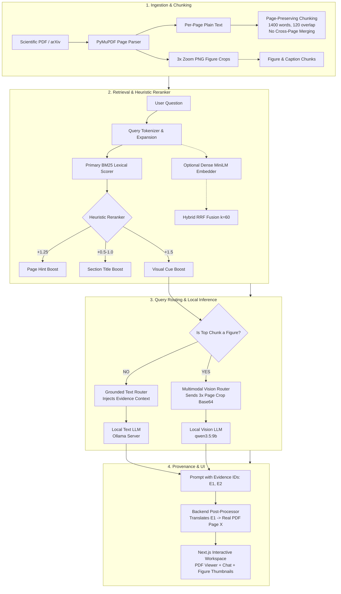
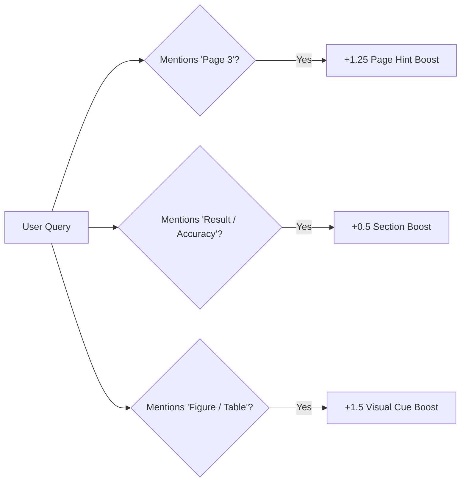

# ScholAR — System & Architecture Master Guide

> **Project:** ScholAR (Smart Companion for Holistic Organization, Literature Analysis & Research)  
> **Core Pitch:** Local-first, privacy-preserving RAG for scientific PDFs with verifiable page citations, multimodal figure reasoning, and multi-document synthesis.

---

## 1. What ScholAR Is (Executive Summary)

ScholAR is an on-device AI research companion that runs 100% locally via Ollama:
- **Zero Cloud Leakage:** Ingests arXiv papers or custom PDFs; inference, vision processing, and embeddings stay on-device.
- **Verifiable Citations:** Maps ephemeral evidence IDs (`[E1]`, `[E2]`) to immutable PDF pages, preventing fabricated page citations.
- **Visual Grounding:** Routes figure/table queries to a local Vision LLM with high-resolution 3× zoom page crops.
- **Multi-Document Reasoning:** Resolves bibliographies via Semantic Scholar API to ingest and cross-read referenced papers.

---

## 2. Complete RAG Pipeline Architecture

ScholAR uses a custom local-first RAG pipeline designed to guarantee that every single claim can be visually highlighted on a real PDF page.

### 📐 End-to-End Pipeline Diagram



---

### 🔍 Deep Dive into RAG Pipeline Components

#### 1. Ingestion & Page-Preserving Chunking Strategy
Standard RAG frameworks chunk text by character count or token length, frequently cutting across page boundaries. When an LLM cites that chunk, it cannot point to an exact single page.
* **Our Rule:** **One chunk $\in$ One page.** No chunk ever spans across multiple pages.
* **Sliding Window:** `target_words = 1400`, `overlap = 120 words` per page.
* **Figure Extraction:** Bounding box detection crops figures/tables at **3× zoom** resolution for optical clarity.

```text
[Page 1] ───> [Chunk 1: Abstract & Intro] (Page 1 only)
[Page 2] ───> [Chunk 2: Method Overview]  (Page 2 only)
[Page 3] ───> [Figure 1 Image + Caption]  (Page 3 only)
```

---

#### 2. Embedding Model & Primary Retrieval Engine
* **Lexical Primary (BM25):** We use BM25 as the primary retrieval signal because scientific papers rely heavily on exact identifiers, formulas, dataset names, and hyperparameter numbers (e.g., `BLEU 28.4`, `lr=1e-4`, `WMT14`).
* **Dense Embedding Model:** Pure PyTorch implementation of `all-MiniLM-L6-v2` (384-dimensional dense vectors). Runs completely locally without heavy external dependencies.
* **Reciprocal Rank Fusion (RRF, $k=60$):** Combines lexical rank and dense rank in the research evaluation suite:
  $$\text{RRF Score}(d) = \frac{1}{60 + \text{Rank}_{\text{BM25}}(d)} + \frac{1}{60 + \text{Rank}_{\text{Dense}}(d)}$$

---

#### 3. Heuristic Re-Ranking Engine
Before passing chunks to the LLM, BM25 scores are dynamically adjusted based on query intent:



* **Query Expansion:** Research-specific synonym expansion (e.g., `result` $\rightarrow$ `accuracy`, `BLEU`, `F1`, `score`).
* **Page Hint Boost (`+1.25`):** If the user asks *"What is on page 4?"*, page 4 chunks are prioritized.
* **Section Boost (`+0.5–1.0`):** Boosts Abstract, Methods, Results, or Limitations sections when implied.
* **Visual Cue Boost (`+1.5`):** If a question mentions *"Figure 2"* or *"Table 1"*, figure chunks jump to Rank 1.

---

#### 4. Multimodal Vision Routing
When a query targets a visual element:
1. Retrieval ranks the figure chunk as top-1.
2. The high-resolution 3× zoom PNG crop of that figure is encoded in **Base64**.
3. Sent directly to the local Vision LLM (`qwen3.5:9b` or `gemma4:12b`) along with the question.
4. **Caption Fallback:** If the local vision model is unavailable, it automatically falls back to text caption QA.

---

#### 5. Indirect Evidence ID Citation Grounding
To eliminate invented or hallucinated page numbers:
1. **Prompt Ingestion:** Retrieved chunks are labeled as `[E1]`, `[E2]`, `[E3]` in the prompt.
2. **Constrained Model Output:** The LLM is instructed to cite *only* using `[E1]`, `[E2]` and is strictly forbidden from generating page numbers.
3. **Application Layer Translation:** The backend maps `[E1]` back to its source chunk's verified metadata $\rightarrow$ rendering a clickable `[1] (Page 3)` chip in the frontend UI.
4. **Guarantee:** **100% of cited page numbers exist on real PDF pages by construction.**

---

#### 6. Multi-Document Expansion (Citation Graph)
* **Semantic Scholar API:** Queries S2 by arXiv ID or paper title to fetch up to 500 reference papers.
* **On-Demand Ingestion:** Users click to ingest any cited paper. It is downloaded, chunked, and tagged with `source_paper_id`.
* **Cross-Paper Retrieval:** Queries search across the anchor paper and all ingested secondary papers simultaneously.

---

## 3. Academic Baseline Papers & Related Works

| Baseline Paper | Focus Area | How It Compares to ScholAR |
|---|---|---|
| **OpenScholar** *(Asai et al., 2024)* | Cloud Scientific RAG | Uses 45M+ paper cloud datastore and frontier LLMs. ScholAR is 100% on-device and privacy-preserving. |
| **PaperQA2** *(Skarlinski et al., 2024)* | Literature Agents | Uses Rerank-Clean-Summarize (RCS) agent loop. Reimplemented locally as our primary baseline. |
| **SciRAG** *(Ding et al., 2025)* | Outline-Guided RAG | Citation-aware multi-doc synthesis; informed our human eval precision/recall framework. |
| **M3SciQA** *(Li et al., EMNLP 2024)* | Multimodal Scientific QA | Benchmark for finding which reference answers a figure question. ScholAR scored **0.474 MRR**. |
| **ColPali** *(Faysse et al., ICLR 2025)* | Visual Doc Retrieval | Patch-level VLM page embeddings; theoretical foundation for our planned visual retrieval engine. |
| **SummaC** *(Laban et al., 2022)* | NLI Faithfulness | Entailment consistency metric; forms Tier 1 of our NLI-CFS scorer. |
| **FActScore** *(Min et al., 2023)* | Atomic Fact Verification | Atomic claim decomposition; foundation for our factual precision evaluations. |
| **BEIR** *(Thakur et al., 2021)* | Zero-Shot Retrieval | Established BM25 superiority over dense embeddings on specialized technical domains. |
| **SlideTailor** *(Zeng et al., 2026)* | PDF Slide Generation | Upstream PDF extraction bottleneck mirrors ScholAR's extraction goals. |

---

## 4. What Is Done (Completed Inventory)

- [x] **Full Backend & REST API:** Complete ingestion, chunking, retrieval, vision, and reference routing.
- [x] **Next.js 15 Frontend:** Resizable split layout, PDF viewer, interactive citation chips (`[1]`), inline figure cards.
- [x] **100-Case / 25-Paper Benchmark:** Mined and source-verified covering 8 scientific claim types.
- [x] **NLI-CFS & LLM Entailment Judge:** 3-tier faithfulness metric + strict LLM contradiction detector.
- [x] **Visual Grounding Pipeline:** 3× zoom page crop rendering with local VLM reasoning (`qwen3.5:9b`).
- [x] **Multi-Document Ingestion:** S2 API bibliography resolution with individual reference paper ingestion.
- [x] **Research Paper Manuscript:** 8-page compiled draft ([`paper/scholar_aaai27.pdf`](file:///Users/prithvirajsangramsinhpatil/Downloads/ScholAR/paper/scholar_aaai27.pdf)) and compliance checklist.
- [x] **Human Evaluation Interface:** Offline blinded scoring tool ([`evaluation/human_eval/score_sheet.html`](file:///Users/prithvirajsangramsinhpatil/Downloads/ScholAR/evaluation/human_eval/score_sheet.html)) with 350 pre-generated model outputs.

---

## 5. Experimentation Results (Key Benchmarks)

### A. Primary Retrieval (100 cases, 25 papers)
* **Finding:** Lexical BM25 significantly outperforms Dense MiniLM embeddings on technical text.

| Method | Recall@1 | Recall@5 | MRR |
|---|---:|---:|---:|
| `dense_only` (`all-MiniLM-L6-v2`) | 0.470 | 0.740 | 0.572 |
| `keyword_overlap` | 0.670 | 0.950 | 0.779 |
| **`bm25_primary` (Ours)** | **0.810** | **0.930** | **0.861** |

---

### B. Local Baseline Comparison (91 cases on `qwen3.5:9b`)
* **Finding:** ScholAR leads in generation correctness and faithfulness while guaranteeing valid page citations.

| System | Generation Faithfulness | Answer Correctness | Citation F1 | Provenance Valid |
|---|---:|---:|---:|---:|
| Long-Context PDF-Chat | 0.801 | 0.267 | 0.742 | ❌ No |
| Vanilla RAG | 0.860 | 0.340 | **0.802** | ❌ No |
| PaperQA2-Style (Local RCS) | 0.872 | 0.550 | 0.782 | ❌ No |
| **ScholAR (Ours)** | **0.892** | **0.563** | 0.760 | **✅ 100%** |

---

### C. M3SciQA Multi-Doc Locality Benchmark (297 cases)
* **Finding:** Visual entity resolution unlocks cross-document search where text retrieval fails.

| System | Deployment | MRR | Recall@5 |
|---|---|---:|---:|
| Human Expert *(published)* | Manual | 0.796 | — |
| GPT-4o *(published)* | Cloud API | 0.500 | — |
| **ScholAR + Local Vision (`qwen3.5:9b`)** | **Local Laptop** | **0.474** | **0.606** |
| **ScholAR + Local Vision (`gemma4:12b`)** | **Local Laptop** | 0.455 | 0.572 |
| GPT-4V *(published)* | Cloud API | 0.400 | — |
| text-embedding-3-large *(published)* | Cloud API | 0.297 | — |
| ScholAR Text-only BM25 | Local Laptop | 0.180 | 0.242 |
| Best Open-Source LMM *(published)* | Server | 0.144 | — |

---

### D. Abstention on Unanswerable Queries (20 negative control cases)
* **Finding:** ScholAR abstains rather than hallucinating when information is absent.
* `qwen3.5:9b`: **100% Abstain** (0% hallucination)
* `llama3.1:8b`: **100% Abstain** (0% hallucination)
* `gemma4:12b`: 95% Abstain
* `mistral:7b`: 90% Abstain

---

### E. On-Device Hardware Efficiency (Apple Silicon 18 GB RAM)
* **BM25 Retrieval Latency:** ~40 ms (instant).
* **Generation Throughput:** 22–27 tok/s across models.
* **End-to-End Latency:** 6.1 s (`mistral:7b`), 6.3 s (`llama3.1:8b`), 11.4 s (`qwen3.5:9b`), 8.8 s (`gemma4:12b`).

---

## 6. Critical Research Takeaways (Honest Findings)

1. **Cosine Faithfulness Inflates Scores by 2×:** Embedding cosine similarity cannot catch contradictions (*"Model A works"* vs *"Model A fails"* look identical in vector space). Our strict LLM Entailment Judge fixes this and gives honest grounding numbers (~0.61 vs inflated ~0.85).
2. **Provenance vs. Faithfulness:** Ephemeral evidence IDs guarantee that 100% of cited page numbers exist, but supporting the claim still depends on retrieval quality (66% support rate). ID grounding buys provenance and auditability.
3. **The M3SciQA Win:** Breaking figure questions into two steps (Vision VLM reads figure $\rightarrow$ BM25 ranks bibliography) delivers **0.474 MRR** locally—beating open-source baselines and approaching GPT-4o.

---

## 7. What Is NOT Done & Future Roadmap

- [ ] **Human Study Execution:** Run the 350-case human evaluation on [`score_sheet.html`](file:///Users/prithvirajsangramsinhpatil/Downloads/ScholAR/evaluation/human_eval/score_sheet.html) and compute Krippendorff's $\alpha$.
- [ ] **Structured Document Parsing:** Benchmark Nougat / Grobid against PyMuPDF for table and equation preservation.
- [ ] **ColPali Visual Page Retrieval:** Index full PDF pages directly with VLM patch embeddings.
- [ ] **LaTeX Math Tokenizer & UI Rendering:** Add symbol-level math tokens and KaTeX rendering to the chat interface.
- [ ] **Interactive Citation Graph:** Build a Connected Papers-style D3 force-directed citation network in the UI.

---

## 8. Developer Quickstart & Runbook

### Prerequisites
1. Python 3.12 (`source .venv312/bin/activate`)
2. Node.js v18+
3. [Ollama](https://ollama.ai) installed and running locally

### 1. Start Ollama & Pull Models
```bash
ollama serve
ollama pull qwen3.5:9b     # Default model
ollama pull gemma4:12b    # Optional eval model
```

### 2. Run the App
Always run from the repository root:
```bash
# Terminal 1: Backend API (http://localhost:8000)
make backend

# Terminal 2: Frontend UI (http://localhost:3000)
make frontend
```

### 3. Run Benchmark Tests
```bash
python3 evaluation/run_retrieval_eval.py --scaled   # Scaled 100-case retrieval
python3 evaluation/run_comparison_eval.py          # Baseline comparisons
python3 evaluation/run_abstention_eval.py          # Abstention evaluation
python3 evaluation/run_efficiency_eval.py          # Latency & memory profile
```

### Common Fixes
* **Fallback message in Chat:** If you see *"I could not get a full model response..."*, Ollama is offline. Start Ollama (`ollama serve`).
* **Port conflicts:** Run `kill $(lsof -t -i:8000 -i:3000)` to clear stuck server processes.
