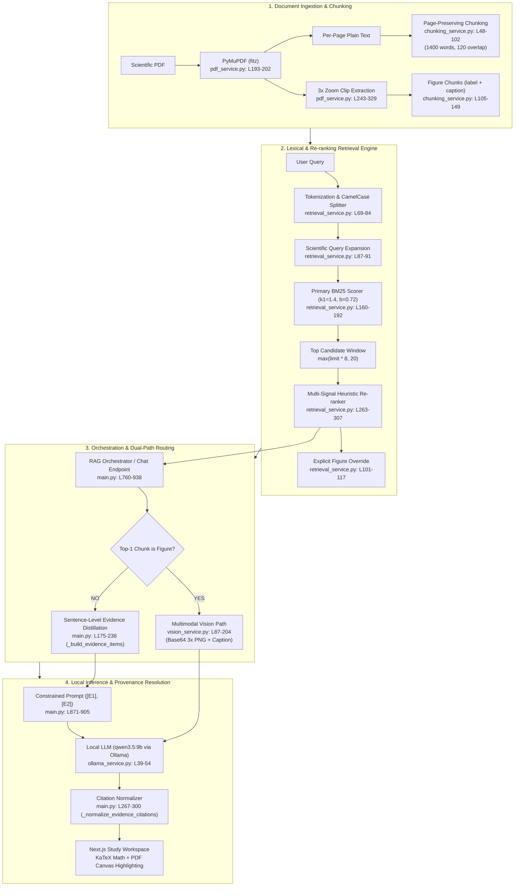

# ScholAR: RAG Pipeline & Retrieval Architecture Manual

> **Document Version:** 1.0 (Canonical Code Reference)  
> **Compiled PDF:** [`docs/SCHOLAR_RAG_ARCHITECTURE_GUIDE.pdf`](file:///Users/prithvirajsangramsinhpatil/Downloads/ScholAR/docs/SCHOLAR_RAG_ARCHITECTURE_GUIDE.pdf)  
> **LaTeX Source:** [`docs/SCHOLAR_RAG_ARCHITECTURE_GUIDE.tex`](file:///Users/prithvirajsangramsinhpatil/Downloads/ScholAR/docs/SCHOLAR_RAG_ARCHITECTURE_GUIDE.tex)

---

## Executive Summary & Architectural Guarantees

ScholAR uses a custom, local-first Retrieval-Augmented Generation (RAG) pipeline designed around three foundational guarantees:

1. **100% Citation Existence by Construction:** Eliminates LLM-generated page hallucinations by constraining the model to ephemeral evidence IDs (`[E1]`, `[E2]`) resolved deterministically to immutable PDF pages in the application layer.
2. **High-Recall Lexical BM25 Primary Scoring:** Prevents semantic drift on exact scientific variables ($d_k$, $p_\theta$), numbers (*BLEU 28.4*), dataset names (*TruthfulQA*), and architecture tokens (*FlashAttention*).
3. **Dual-Path Multimodal Routing:** Seamlessly routes figure and table queries to a local Vision LLM with high-resolution $3\times$ zoom image crops.

---

## 1. System Architecture Map & Component Index



### Complete Code Location Matrix

| Component | Source File | Key Functions | Exact Line Range |
|---|---|---|---|
| **Orchestrator** | [`backend/main.py`](file:///Users/prithvirajsangramsinhpatil/Downloads/ScholAR/backend/main.py) | `chat`, `_build_evidence_items`, `_format_evidence_context`, `_normalize_evidence_citations` | [L175–L300](file:///Users/prithvirajsangramsinhpatil/Downloads/ScholAR/backend/main.py#L175-L300), [L760–L938](file:///Users/prithvirajsangramsinhpatil/Downloads/ScholAR/backend/main.py#L760-L938) |
| **PDF Extraction & Highlighting** | [`backend/services/pdf_service.py`](file:///Users/prithvirajsangramsinhpatil/Downloads/ScholAR/backend/services/pdf_service.py) | `download_pdf`, `extract_pages`, `extract_figures`, `render_page_png`, `_highlight_quote_words` | [L153–L485](file:///Users/prithvirajsangramsinhpatil/Downloads/ScholAR/backend/services/pdf_service.py#L153-L485) |
| **Chunking Engine** | [`backend/services/chunking_service.py`](file:///Users/prithvirajsangramsinhpatil/Downloads/ScholAR/backend/services/chunking_service.py) | `chunk_pages`, `chunk_figures`, `_section_title`, `_chunk_type` | [L17–L149](file:///Users/prithvirajsangramsinhpatil/Downloads/ScholAR/backend/services/chunking_service.py#L17-L149) |
| **BM25 & Retrieval Service** | [`backend/services/retrieval_service.py`](file:///Users/prithvirajsangramsinhpatil/Downloads/ScholAR/backend/services/retrieval_service.py) | `_bm25_scores`, `retrieve_chunks`, `tokenize`, `expand_query_terms`, `extract_figure_refs` | [L69–L325](file:///Users/prithvirajsangramsinhpatil/Downloads/ScholAR/backend/services/retrieval_service.py#L69-L325) |
| **Hybrid Evaluation (RRF)** | [`evaluation/hybrid_retrieval.py`](file:///Users/prithvirajsangramsinhpatil/Downloads/ScholAR/evaluation/hybrid_retrieval.py) | `retrieve_hybrid`, `_rrf`, `_dense_ranked` | [L64–L183](file:///Users/prithvirajsangramsinhpatil/Downloads/ScholAR/evaluation/hybrid_retrieval.py#L64-L183) |
| **Vision Service** | [`backend/services/vision_service.py`](file:///Users/prithvirajsangramsinhpatil/Downloads/ScholAR/backend/services/vision_service.py) | `answer_with_figure`, `_build_vision_prompt`, `_load_figure_png` | [L35–L204](file:///Users/prithvirajsangramsinhpatil/Downloads/ScholAR/backend/services/vision_service.py#L35-L204) |
| **LLM Engine** | [`backend/services/ollama_service.py`](file:///Users/prithvirajsangramsinhpatil/Downloads/ScholAR/backend/services/ollama_service.py) | `generate`, `generate_study_goals`, `fallback_goals`, `_select_study_goal_chunks` | [L39–L385](file:///Users/prithvirajsangramsinhpatil/Downloads/ScholAR/backend/services/ollama_service.py#L39-L385) |
| **Frontend Chat & KaTeX Math** | [`frontend/components/ChatBox.tsx`](file:///Users/prithvirajsangramsinhpatil/Downloads/ScholAR/frontend/components/ChatBox.tsx) | `InlineMath`, `looksLikeMath`, `renderInline` | [L48–L105](file:///Users/prithvirajsangramsinhpatil/Downloads/ScholAR/frontend/components/ChatBox.tsx#L48-L105) |
| **Frontend PDF Viewer** | [`frontend/components/PdfViewer.tsx`](file:///Users/prithvirajsangramsinhpatil/Downloads/ScholAR/frontend/components/PdfViewer.tsx) | `pageImageUrl`, `scrollToPage`, `handleScroll` | [L44–L78](file:///Users/prithvirajsangramsinhpatil/Downloads/ScholAR/frontend/components/PdfViewer.tsx#L44-L78) |

---

## 2. Ingestion & Page-Preserving Chunking

### 1. Strict Single-Page Chunking Constraint
* **Source Code:** [`backend/services/chunking_service.py`](file:///Users/prithvirajsangramsinhpatil/Downloads/ScholAR/backend/services/chunking_service.py#L48-L102) (`chunk_pages`)
* **Core Rule:** $\text{Chunk}_i \subseteq \text{Page}_k$. No chunk ever spans across a page boundary.
* **Sliding Window:** `target_words = 1400`, `overlap_words = 120`.
* **Section Classification (`_chunk_type`):** Regex pattern matching categorizes chunks into `abstract`, `introduction`, `method`, `experiment`, `result`, `limitation`, or `body`.
* **Multi-Document Metadata:** Every chunk stores `page`, `char_start`, `char_end`, `section_title`, and an optional `source_paper_id` for cross-referenced documents.

### 2. High-Resolution Visual Region Extraction
* **Source Code:** [`backend/services/pdf_service.py`](file:///Users/prithvirajsangramsinhpatil/Downloads/ScholAR/backend/services/pdf_service.py#L243-L329) (`extract_figures`)
* **Detection:** Regex `_CAPTION_RE` finds `Figure N` and `Table N` caption labels.
* **Bounding Box:** `_caption_bbox()` inspects PyMuPDF layout blocks on the page.
* **Region Clip:** Clips from $y_0 - 0.38 \times \text{height}$ (above caption) to $y_1 + 0.12 \times \text{height}$ (below caption).
* **3.0x Zoom Matrix:** Rendered via `fitz.Matrix(3.0, 3.0)` to PNG to preserve subplots and axis notation.
* **Searchable Figure Chunks:** `chunk_figures()` converts metadata into chunks with `text = label + ": " + caption` and `is_figure_chunk = True`.

---

## 3. The Retrieval Engine & Deep Dive into BM25

### 1. Mathematical Formulation of BM25
* **Source Code:** [`backend/services/retrieval_service.py`](file:///Users/prithvirajsangramsinhpatil/Downloads/ScholAR/backend/services/retrieval_service.py#L160-L192) (`_bm25_scores`)

$$\text{Score}_{\text{BM25}}(D, Q) = \sum_{q_i \in Q} w(q_i) \cdot \text{IDF}(q_i) \cdot \frac{f(q_i, D) \cdot (k_1 + 1)}{f(q_i, D) + k_1 \cdot \left(1 - b + b \cdot \frac{|D|}{\text{avgdl}}\right)}$$

$$\text{IDF}(q_i) = \ln\left( \frac{N - n(q_i) + 0.5}{n(q_i) + 0.5} + 1 \right)$$

* **Calibrated Constants:**
  * $k_1 = 1.4$: Governs the term frequency saturation non-linearity.
  * $b = 0.72$: Controls document length penalization.
  * $w(q_i)$ (`query_weight`): Multiplier for repeated terms in query (`Counter(query_terms)`).

### 2. Multi-Signal Heuristic Re-Ranking
* **Source Code:** [`backend/services/retrieval_service.py`](file:///Users/prithvirajsangramsinhpatil/Downloads/ScholAR/backend/services/retrieval_service.py#L263-L307) (`retrieve_chunks`)

```python
rerank_score = bm25_score
rerank_score += semantic * 0.03            # 128-dim MD5 hashed cosine vector
rerank_score += expansion_overlap * 0.05   # Scientific synonym overlap
rerank_score += exact_overlap * 0.08       # Literal query term overlap

if chunk.get("page") in preferred_pages:
    rerank_score += 1.25                   # Boost for user page mentions ("page 4")
if chunk.get("chunk_type") in section_hints:
    rerank_score += 0.08                   # Section intent match (method, result, etc.)
if any(phrase in lowered for phrase in ("we propose", "we introduce", "we present")):
    rerank_score += 0.08                   # Active contribution claim bonus

# Visual-Cue Multiplier:
if chunk.get("is_figure_chunk") and visual_query:
    rerank_score *= 2.5                    # 2.5x boost for figures on visual questions
    rerank_score += 1.8 * label_overlap    # Caption token overlap bonus
```

* **CamelCase Splitting (L69–84):** Fused names (*FlashAttention*) emit both the compound token and sub-tokens (`flash`, `attention`).
* **Explicit Figure Override (L101–116):** Queries naming specific figures (e.g. *"Figure 2"*) extract the exact identifier and pin the figure chunk to Rank 1.

---

## 4. RAG Headquarter: Dual-Path Routing & Inference

* **Source Code:** [`backend/main.py`](file:///Users/prithvirajsangramsinhpatil/Downloads/ScholAR/backend/main.py#L760-L938) (`chat` endpoint)

### 1. Dual-Path Routing
* **Figure Hit (`is_figure_chunk == True`):** Routes to [`vision_service.py`](file:///Users/prithvirajsangramsinhpatil/Downloads/ScholAR/backend/services/vision_service.py#L87-L204). Encodes 3x PNG crop as Base64, appends caption and supporting text, and invokes `qwen3.5:9b`.
* **Text Hit:** Routes to sentence-level evidence builder.

### 2. Sentence-Level Evidence Distillation (`_build_evidence_items`, L175–238)
Extracts candidate sentences from top 4 chunks, filters boilerplate noise, and labels them with ephemeral IDs:
```text
[E1 | anchor | p. 3 | chunk_003]
"We train our probe battery across all 12 transformer layers using..."

[E2 | anchor | p. 5 | chunk_005]
"Our model achieves a BLEU score of 28.4 on the WMT14 benchmark..."
```

### 3. Indirect Evidence-ID Citation Grounding
* **Prompt Constraint (L871–905):** Strictly forbids the LLM from writing page numbers; requires citing `[E1]`, `[E2]`.
* **Application Normalizer (`_normalize_evidence_citations`, L267–300):** Validates emitted IDs against the retrieved list, maps `[E1] ➔ [1]`, and attaches ground-truth metadata:
  ```json
  {
    "ref_id": 1,
    "page": 3,
    "chunk_id": "chunk_003",
    "section_title": "Method",
    "quote": "We train our probe battery across all 12 transformer layers using..."
  }
  ```

---

## 5. Canvas Highlighting & Mathematical Semantics

### 1. Word-Level Highlighting on PDF Canvas
* **Source Code:** [`backend/services/pdf_service.py`](file:///Users/prithvirajsangramsinhpatil/Downloads/ScholAR/backend/services/pdf_service.py#L356-L470) (`render_page_png`, `_highlight_quote_words`)
* Uses PyMuPDF's `page.search_for()` for exact matches; falls back to sliding-window token matching over `page.get_text("words")` when line breaks split sentences.
* Merges contiguous word rectangles on the same line and draws a semi-transparent blue highlight overlay.

### 2. Mathematical Semantics & KaTeX Rendering
* **Unicode Normalization:** [`_normalize_pdf_text()`](file:///Users/prithvirajsangramsinhpatil/Downloads/ScholAR/backend/services/pdf_service.py#L382-L394) normalizes mathematical Unicode symbols (minus signs, dashes, ligatures).
* **KaTeX Rendering:** [`frontend/components/ChatBox.tsx`](file:///Users/prithvirajsangramsinhpatil/Downloads/ScholAR/frontend/components/ChatBox.tsx#L48-L86) parses math blocks (`$...$` and `$$...$$`) via `katex.renderToString()`, with currency detection to preserve strings like `"$50 million"`.
