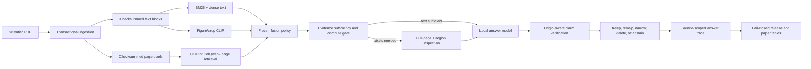

# EACL 2027 Industry Track implementation plan

Status: architecture audit complete; implementation and measured studies not yet complete  
Audit date: 2026-08-31  
Submission deadline: 2026-09-11, 23:59 AoE  
Venue requirements: [official EACL 2027 Industry Track call](https://2027.eacl.org/calls/industry/)

## 1. Decision

The paper should tell one coherent systems story:

> ScholAR is a strict-local, auditable scientific-document QA system that runs visual retrieval for every query, selectively inspects source pixels when text is insufficient, and applies claim-level repair under an explicit support-versus-coverage contract.

The primary empirical claim should be:

> On a paper-disjoint scientific QA benchmark, always-on late-interaction page retrieval plus bounded pixel inspection improves answer coverage on implicit visual questions without reducing human-judged claim support, while preserving source lineage and consumer-hardware deployment constraints.

This framing fits the Industry Track emphasis on deployed systems, operational maturity, evaluation and testing practices, low-cost implementation, model governance, auditability, and reliability. It is larger than an image-embedding comparison, but it remains narrow enough for a six-page paper.

Acceptance cannot be guaranteed. The plan is designed to make every reported claim traceable to a frozen run and to remove the validity problems currently present in the executable system.

## 2. What the code currently does

This summary is based on executable code and stored artifacts, not project documentation.

| Area | Executed implementation | Paper consequence |
|---|---|---|
| Ingestion | `PaperFinalizeService` stages a paper bundle, validates identities, hashes, images, SQLite rows, and atomically publishes it. `DualEngineIngestionService` uses Docling when available and PyMuPDF otherwise. | Strong operational contribution, but the research corpus must first be migrated to this schema. |
| Stored corpus | 116 paper directories exist; 87 contain PDFs, 88 contain chunks, 25 contain `figures.json`, 5 contain an Evidence AST, 1 contains `visual_units.json`, and 0 contain the new ingestion manifest. | No current paper bundle passes the new completeness contract. Headline experiments are blocked. |
| Text retrieval | BM25, all-MiniLM-L6-v2 dense retrieval, heuristic modality ranking, reciprocal-rank fusion, and a MiniLM cross-encoder reranker. Both dense and reranker paths can silently switch to deterministic lexical fallbacks. | Product behavior is resilient; measured conditions are not yet isolated. |
| Crop retrieval | Cache-only CLIP image/text embeddings over extracted figures and tables. | Useful baseline; its 0.20 score floor is explicitly uncalibrated. |
| Page retrieval | Cache-only CLIP tiled patch MaxSim or native Transformers `vidore/colqwen2-v1.0-hf` late interaction over full rendered pages. | This is the strongest method component. The ColQwen model snapshot is not currently provisioned and its default score floor admits every finite score. |
| Fusion | Equal-weight RRF over lexical, dense, modality, crop-image, and page-image rankings, followed by the cross-encoder. | A valid production heuristic, but weights, thresholds, and fallback state are not frozen by the release configuration. |
| Visual inspection | Selected page/figure pixels are optionally cropped from ColQwen patch attribution. A local Qwen 3.5 vision model first produces per-image JSON observations, then generates an answer from pixels, observations, and text. | Two-pass inspection is useful, but the same model currently observes and answers. Derived observations must not be treated as independent source evidence. |
| Sufficiency | Lexical query/evidence overlap can answer, abstain, or route a score-qualified visual candidate to inspection. | Thresholds are heuristic and require development-only calibration. |
| Verification | Atomic answer spans are checked with lexical overlap; selective repair can remap citations, narrow a claim by deletion, delete it, or abstain. | A promising intervention, but it is not semantic entailment and is not calibrated. Visual observations can create circular apparent support. |
| Reasoning graph | Rule-based nodes and edges are built after retrieval and displayed in traces/UI. | It does not control retrieval or generation and must not be claimed as a reasoning improvement. |
| Numeric plan | A heuristic selects a table and the first two long query words, then attempts a difference calculation. The result is recorded but not inserted into generation. | Do not claim numeric reasoning in this paper unless it is redesigned and evaluated. |
| API | `/chat` and `/chat/stream` call the same `AnswerPipelineService`; the latter emits the completed answer as one token rather than streaming model tokens. | Shared production/evaluation path is a strength. Do not claim token streaming or time-to-first-token. |
| Governance | Answer traces record source-scoped identities, channel ranks, models, timings, repairs, abstentions, and generation metadata. Release-v1 freezes keys, seeds, output hashes, denominators, gates, and tables. | Strong Industry Track contribution; retrieval and corpus identities must be added to the frozen condition. |
| Release readiness | The measured EACL release is `NOT_READY`; all nine external and empirical gates remain pending. | Old result files cannot be used. A new measured release must fail closed until every required gate is cleared. |

## 3. Research questions

- RQ1 — Retrieval: How much do CLIP page retrieval and ColQwen2 late interaction improve page and region retrieval over text-only and crop-only retrieval, especially when the query does not mention a figure, table, plot, or image?
- RQ2 — End-to-end utility: Does always-on visual retrieval plus selective pixel inspection improve answer key-point coverage and answerability on implicit visual questions?
- RQ3 — Reliability: Does deterministic selective repair improve human-judged claim support without exceeding a predeclared loss in answer coverage?
- RQ4 — Deployment: What latency, memory, index-size, failure-recovery, and cold/warm-start costs arise on named consumer hardware?

RQ1–RQ3 are primary. RQ4 is the Industry Track deployment analysis. Parser, evidence-graph, multidocument, and numeric-reasoning claims are out of scope for the submission-critical path.

## 4. Target architecture



The architecture has two modes:

- Product mode permits an explicitly recorded fallback and prioritizes graceful degradation.
- Measured mode forbids silent fallback, requires exact model and corpus identities, and writes an error row instead of changing the experimental condition.

## 5. Submission-critical implementation phases

### Phase 0 — Freeze scope and provision required assets

Goal: make it possible to execute the intended condition rather than an undocumented fallback.

Tasks:

1. Obtain explicit approval for the roughly 4.4 GB ColQwen2 snapshot, then provision it outside runtime execution.
2. Record the Hugging Face revision and an artifact SHA-256 in the model registry.
3. Record the Qwen 3.5 Ollama digest and quantization.
4. Verify that all-MiniLM-L6-v2, the cross-encoder, CLIP, and ColQwen2 are cache-resident under strict-local flags.
5. Select the development and held-out paper IDs before migrating or annotating them.
6. Treat all existing benchmark cases and earlier result files as development evidence only.

Acceptance gate:

- A preflight command must load every required model with network calls denied.
- Measured mode must fail when any named artifact, revision, digest, or quantization differs.

Primary code anchors:

- `backend/services/network_policy_service.py`
- `backend/services/visual_embedding_service.py`
- `backend/services/colqwen_visual_retrieval_service.py`
- `backend/services/ollama_service.py`
- `scripts/prebuild_visual_indexes.py`
- `evaluation/run_evaluation_profiles.py`

### Phase 1 — Migrate and freeze a valid corpus

Goal: every experimental paper has one complete, internally consistent source bundle.

Tasks:

1. Run `scripts/migrate_visual_artifacts.py` first in dry-run mode on the selected paper set.
2. Re-finalize selected papers transactionally. Do not evaluate a paper unless `PaperFinalizeService.load_if_complete` succeeds.
3. Prebuild the CLIP and ColQwen page indexes only after publication of the source bundle.
4. Add `evaluation/corpus/build_manifest.py` to write a corpus manifest containing, per paper:
   - paper ID;
   - PDF SHA-256;
   - ingestion generation ID and schema version;
   - chunks SHA-256;
   - page-image SHA-256 values;
   - parser engine and degraded-mode flag;
   - page, chunk, figure, and visual-unit counts;
   - each derived index manifest hash.
5. Add a validator that rejects missing, duplicated, development/test-overlapping, or changed paper identities.
6. Separate cleanly parsed and degraded PyMuPDF papers in the data card. Do not mix them without stratified reporting.

Acceptance gate:

- 100% of experimental paper bundles validate.
- 100% of referenced page images pass checksums.
- Development and test paper sets are disjoint.
- The corpus manifest hash is stored in every measured row.

### Phase 2 — Make chunking and parser conditions real

Goal: remove labels that imply unimplemented ablations.

Current problem: `_generate_chunks_from_ast` creates one retrieval chunk per AST block and ignores `chunk_token_size`, `chunk_overlap`, and the named chunking strategy. The P0–P4 labels therefore do not represent five controlled chunking algorithms. `benchmark_parsers.py` also writes into live paper directories.

Tasks:

1. Introduce a typed `ChunkingPolicy` with a version, tokenizer identity, target size, overlap, page-boundary rule, section-boundary rule, and atomic table/figure rule.
2. Implement the conditions literally:
   - fixed window over page text;
   - heuristic AST plus bounded windows;
   - flattened Docling plus bounded windows;
   - Docling semantic grouping;
   - provenance AST semantic grouping.
3. Preserve tables and figure captions as atomic chunks.
4. Prevent text chunks from crossing a paper or page identity boundary.
5. Run parser ablations in temporary output directories and never mutate production bundles.
6. For the primary paper system, freeze one policy after development calibration. Do not tune it on held-out papers.

Acceptance gate:

- Each declared chunking condition produces a distinct, deterministic chunk hash on a fixture.
- Chunk sizes and overlap satisfy their declared bounds.
- The parser benchmark leaves source bundles byte-identical.

### Phase 3 — Add a frozen retrieval control plane

Goal: ensure each reported condition is exactly reproducible.

Add a strict `RetrievalControls` schema to `AnswerPipelineRequest` and release `SystemOptions`:

```text
bm25_enabled
dense_enabled
modality_enabled
crop_image_enabled
page_image_enabled
page_backend = disabled | clip | colqwen2
reranker_mode = disabled | required
fusion_method
fusion_k
channel_weights
channel_candidate_limits
final_top_k
context_prelude_enabled
threshold_profile_id
fallback_policy = forbidden | recorded
```

Tasks:

1. Replace loosely coupled boolean parameters in `retrieve_chunks` with the typed controls.
2. Return a structured retrieval result containing ranked hits, all channel statuses, resolved models, thresholds, timings, and failures.
3. In measured mode, forbid:
   - dense feature-hash fallback;
   - heuristic reranker fallback;
   - ColQwen-to-CLIP automatic fallback;
   - missing channel execution;
   - unversioned threshold overrides.
4. Keep those fallbacks available and visible in product mode.
5. Remove the unconditional `chunks[:2]` context prelude in measured mode. It currently leaks the first two paper chunks into generation independently of retrieval.
6. Globally fuse duplicate hits across global and decomposed queries. The current first-seen append order is not a cross-query ranking.
7. Use deterministic tie breaking by source ID, page, and local evidence ID.
8. Record every candidate pool and selection boundary required to reconstruct the final rank.

Acceptance gate:

- A release condition hash changes when any retrieval control changes.
- A requested ColQwen condition cannot complete with CLIP or no page channel.
- Repeated runs with identical inputs produce identical retrieval rankings.

Primary code anchors:

- `backend/schemas/answer_trace.py`
- `backend/services/retrieval_service.py`
- `backend/services/reranker_service.py`
- `backend/services/answer_pipeline.py`
- `evaluation/release/schemas.py`
- `evaluation/release/identity.py`

### Phase 4 — Calibrate page selection and region inspection

Goal: turn visual similarity from an uncalibrated candidate generator into a development-calibrated compute gate.

Tasks:

1. Preserve raw ColQwen MaxSim for ranking, but do not use the default `-1e9` floor as evidence confidence.
2. On development papers only, fit a small calibration artifact from:
   - top page score;
   - top-1/top-2 margin;
   - query length;
   - page count;
   - agreement with text retrieval;
   - explicit versus implicit formulation.
3. Select the inspection threshold using a predeclared objective: maximize implicit-visual recall subject to a fixed false-inspection budget.
4. Serialize coefficients, development corpus hash, metric, selected threshold, code revision, and calibration date to JSON.
5. Improve hierarchical inspection:
   - retain the full page as context;
   - expand the top candidate region slightly so axes and legends remain visible;
   - send the full page and crop together when the hardware/image budget permits;
   - fall back to the full page, not captions, if region attribution is invalid.
6. Keep patch-derived boxes explicitly labeled as retrieval attribution, not object detection or verified grounding.

Acceptance gate:

- No held-out label enters the calibration artifact.
- The threshold profile hash is present in the trace.
- Region coordinates map back to the exact checksummed source page.
- The visual condition reports both page selection and region selection failures.

### Phase 5 — Remove circular visual verification

Goal: distinguish source evidence from model-derived observations.

Current problem: the vision model produces a visual observation and an answer; the observation is appended to a citation quote; lexical verification can then mark the answer supported by text produced by the same model. This is not independent pixel grounding.

Tasks:

1. Add an evidence-origin enum:
   - `SOURCE_TEXT`;
   - `SOURCE_TABLE`;
   - `SOURCE_PIXELS`;
   - `MODEL_VISUAL_OBSERVATION`;
   - `APPLICATION_IMPUTED`.
2. Store model observations as derived artifacts linked to, but never substituted for, the source pixel identity.
3. For text claims, add a local semantic support scorer behind the existing `SupportScorer` interface. Retain lexical overlap as a named baseline.
4. Calibrate semantic thresholds only on development claim/evidence labels.
5. For visual claims:
   - use human pixel-support judgments as the primary paper metric;
   - report an automated visual judge only as a separately validated diagnostic;
   - never call the answer model's own transcription independent verification.
6. Preserve the current allowed repair operations—citation remap, deletion-derived narrowing, deletion, abstention—and forbid free-form regeneration during repair.
7. Add `UNVERIFIED_VISUAL` or an equivalent explicit state so text-only verification cannot silently approve a pixel claim.
8. Freeze support and coverage thresholds before held-out generation.

Acceptance gate:

- A visual claim cannot become `SUPPORTED` solely because the answer model repeated its own observation.
- Every retained claim links to source evidence and records the scorer, version, threshold profile, and origin.
- Selective repair passes the predeclared human support/coverage gate.

### Phase 6 — Align actual answer behavior with the paper

Goal: ensure claimed components causally affect the returned answer.

Tasks:

1. Keep the paper focus on retrieval, selective inspection, verification, and auditability.
2. Do not include the EvidenceGraph in a method claim unless an ablation shows that it changes retrieval, prompt construction, or generation.
3. Do not include deterministic table arithmetic in a capability claim unless:
   - entities and metric columns are resolved robustly;
   - the numeric plan is shown to the generator or directly incorporated into the final answer;
   - numeric accuracy is separately evaluated.
4. Either implement genuine SSE token streaming or describe `/chat/stream` as staged trace delivery.
5. Surface in the UI and API:
   - visual backend and model;
   - whether full page, crop, or both were inspected;
   - source page and region;
   - fallback or failure state;
   - verification origin.

Acceptance gate:

- Every feature named in the main contribution has a tested causal path to the final response.
- Decorative trace artifacts are labeled as explanations, not reasoning improvements.

### Phase 7 — Upgrade release-v1 to freeze the full experiment

Goal: make the measured release impossible to confuse with product defaults or legacy evidence.

Tasks:

1. Version the release schema rather than mutating release-v1 fixtures.
2. Add to the frozen row identity:
   - corpus manifest hash;
   - ingestion and chunking policy identities;
   - retrieval controls;
   - dense, reranker, CLIP, ColQwen, and generator identities;
   - calibration artifact hashes;
   - hardware tier and exact device;
   - visual observation prompt hash;
   - answer prompt hash;
   - verifier/scorer identity;
   - fallback policy.
3. Add immutable error rows for any condition mismatch or missing model.
4. Add channel execution validators that read the `AnswerTrace`, not environment assumptions.
5. Generate paper tables only from a validated release and a passed human primary gate.
6. Preserve the existing all-expected denominator rule so failures are never dropped.

Acceptance gate:

- The release validator reconstructs every condition from its config and trace.
- Every expected `(system, model, seed, case)` key has exactly one success, abstention, or error row.
- Table provenance resolves to the release manifest and human gate hashes.

## 6. Frozen system conditions

The minimum end-to-end comparison should use the same generator, seed set, prompt family, corpus, and final context budget.

| ID | Text channels | Crop channel | Page channel | Pixel inspection | Repair | Purpose |
|---|---|---|---|---|---|---|
| S0 | BM25 + dense + reranker | Off | Off | Off | None | Strong text-only control |
| S1 | Same | CLIP | Off | Extracted crop only | None | Existing figure-retrieval baseline |
| S2 | Same | Off | CLIP page | Full page | None | Single-vector/tiled-page baseline |
| S3 | Same | Off | ColQwen2 page | Full page | None | Late-interaction retrieval effect |
| S4 | Same | Off | ColQwen2 page | Full page + attributed crop | None | Hierarchical inspection effect |
| S5 | Same | Off | ColQwen2 page | Full page + attributed crop | Selective | Full proposed system |

Do not use `auto` as a paper condition. It is a product configuration, not an experimentally stable method.

## 7. Code-change map

| File or module | Required change |
|---|---|
| `backend/schemas/answer_trace.py` | Add typed retrieval controls, evidence origins, model/index/calibration identities, and measured fallback policy. |
| `backend/services/ingestion_service.py` | Implement the declared chunking strategies rather than one-block/one-chunk for every policy. |
| `backend/services/paper_finalize_service.py` | Expose stable source-bundle identity to the corpus manifest. |
| `backend/services/retrieval_service.py` | Consume typed controls, return a structured result, globally fuse subqueries, and remove uncontrolled context leakage. |
| `backend/services/dense_embedding_service.py` | Expose mode and artifact identity; fail instead of feature hashing in measured mode. |
| `backend/services/reranker_service.py` | Expose model identity; fail instead of heuristic ranking in measured mode. |
| `backend/services/visual_embedding_service.py` | Bind CLIP thresholds and index manifests to calibration/corpus hashes. |
| `backend/services/colqwen_visual_retrieval_service.py` | Bind threshold/calibrator identity; retain raw score and patch attribution. |
| `backend/services/vision_service.py` | Preserve source-versus-derived evidence, support full-page-plus-crop inspection, and record both generation passes. |
| `backend/services/verifier_service.py` | Add semantic scorer, evidence-origin rules, calibrated profiles, and an explicit visual-verification state. |
| `backend/services/answer_pipeline.py` | Enforce measured-mode controls and global retrieval ordering; remove first-chunk prelude from measured prompts. |
| `evaluation/release/*` | Introduce schema v2 identities and channel-execution validation. |
| `evaluation/run_visual_retrieval_eval.py` | Separate channel retrieval metrics from final fused-hit metrics and add paired condition deltas. |
| `evaluation/run_visual_end_to_end_eval.py` | New exact-production end-to-end runner. |
| `evaluation/statistics.py` | Shared paper-clustered paired intervals and tests. |
| `scripts/migrate_visual_artifacts.py` | Add selected-corpus manifest output and post-migration validation. |
| `scripts/prebuild_visual_indexes.py` | Prebuild both baselines, write identities, and fail on partial source coverage. |
| `tests/` | Add experiment-control, origin, corpus, calibration, and no-fallback integration tests. |

## 8. Schedule to the submission deadline

This is an aggressive submission-critical schedule. Work outside the critical claim must be cut.

| Date | Required outcome | Go/no-go rule |
|---|---|---|
| Aug 31 | Scope, architecture, implementation plan, and testing plan frozen | No new primary contribution after this point |
| Sep 1 | Model assets provisioned; selected corpus migrates cleanly | If ColQwen cannot run locally, change the paper to a systems/governance study and do not claim ColQwen results |
| Sep 2 | Retrieval controls, measured no-fallback mode, and corpus manifest implemented | No experiment without frozen condition identity |
| Sep 3 | Development visual annotations and threshold calibration complete | Held-out data remains unopened |
| Sep 4 | Held-out benchmark and data card frozen; paper-disjoint check passes | If not frozen, stop headline runs |
| Sep 5–6 | All retrieval and end-to-end conditions complete over all seeds | Any missing row remains an error in the denominator |
| Sep 7–8 | Blinded human support/coverage labels and adjudication complete | No automated verifier score may replace the human primary metric |
| Sep 9 | Statistics, tables, failure analysis, and resource profile sealed | Tables must be generated from validated release only |
| Sep 10 | Six-page paper, limitations, ethics, appendix, and anonymous supplement finalized | Run paper and anonymity validators |
| Sep 11 | Independent artifact reproduction and final PDF inspection | Submit only if all main claims have passed provenance gates |

## 9. Explicit non-claims and cut order

The following should be excluded from the main paper unless their acceptance gates are completed:

1. Parser superiority—the declared chunking ablations are not yet implemented literally.
2. Evidence-graph reasoning—the graph is post-retrieval trace construction, not a causal reasoner.
3. Exact numeric QA—the current numeric plan is heuristic and unused in the answer.
4. Broad multidocument superiority—the main answer path can pool sources, but this would require a separate source-balanced benchmark.
5. Calibrated cross-encoder probabilities—the current reranker scores and boosts are not calibrated probabilities.
6. Independent visual verification—the current observation and answer can come from the same model.
7. Real-time token streaming—the current SSE route emits a completed answer.
8. Production deployment claims unsupported by real usage logs—describe the system as deployment-oriented and locally executable unless longitudinal evidence exists.

If time is lost, cut in this order: parser ablation, multidocument study, numeric QA, UI study, secondary model comparison. Never cut corpus validity, condition identity, held-out separation, human support judgment, or error accounting.

## 10. Architecture-complete definition

The system is ready to enter the final testing phase only when all of the following are true:

- selected paper bundles and indexes validate against one frozen corpus manifest;
- ColQwen, CLIP, dense, reranker, and generator artifacts are cache-only and hash-identified;
- release conditions freeze all retrieval, generation, inspection, and repair controls;
- measured runs cannot silently fall back;
- text, pixel, and model-derived evidence origins are distinct;
- visual claims cannot be self-verified by the answer model's own observation;
- development calibration and held-out evaluation are paper-disjoint;
- the exact production answer path emits a complete trace for every expected row;
- unit, integration, live-model, and release-governance tests pass.

Only after this definition is met should final benchmark results be generated.
