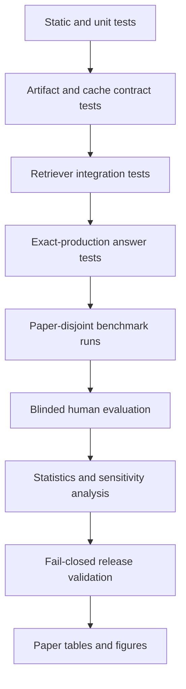

# EACL 2027 Industry Track testing and experimental plan

Status: planned; final measured studies must wait for the architecture-complete gate in `IMPLEMENTATION_PLAN.md`  
Audit date: 2026-08-31

## 1. Objective

The testing program must establish four things:

1. the implementation behaves as declared;
2. visual retrieval helps implicit visual questions rather than only explicit “figure” queries;
3. selective repair improves claim support without hiding failures or destroying useful answer coverage;
4. the system remains practical, auditable, and fail-safe on consumer hardware.

Unit-test counts or old result files are engineering evidence, not paper evidence. Paper tables must come only from the frozen held-out release.

Current engineering baseline on 2026-08-31:

- 169 backend/evaluation tests pass under strict-local and Hugging Face offline flags;
- the release-v1 artifact fixture reproduces successfully;
- the complete portable smoke profile passes;
- the frontend TypeScript check passes;
- the active Python environment is CPython 3.12 with the pinned evaluation stack;
- the active Node.js version is 24 rather than the CI-declared Node.js 20 and must not be used as the frozen release environment;
- no live ColQwen result has been measured because its local snapshot is absent;
- no final model-backed, held-out, human, or hardware result is currently release-ready.

## 2. Test layers



No higher layer may compensate for a failed lower layer.

## 3. Dataset design

### 3.1 Development set

Purpose: threshold selection, fusion tuning, prompt debugging, annotation training, and power planning.

Minimum target:

- 10–15 scientific papers;
- at least three document/layout domains;
- 80 explicit/implicit visual question pairs;
- balanced figures, plots, tables, diagrams, and mixed text/visual evidence;
- at least 20 unanswerable or wrong-document cases;
- gold page labels for every case;
- gold region boxes where a bounded region is meaningful;
- answer key points and source evidence identities.

Development papers may include existing benchmark papers. Their results must never be reported as held-out performance.

### 3.2 Held-out test set

Purpose: all headline results.

Minimum viable target under the current deadline:

- at least 20 paper-disjoint test papers, with 30 preferred;
- 100 explicit/implicit pairs, giving 200 visual questions;
- 100 additional general scientific QA questions to detect regressions;
- 60 answerability cases: absent evidence, wrong paper, visually unreadable evidence, or deliberately incomplete context;
- at least 25 cases each for tables, plots, diagrams, and mixed evidence;
- papers not used for threshold selection, prompt tuning, case mining, or debugging.

Each explicit/implicit pair must ask for the same information. The explicit form may mention the visual locus; the implicit form must not contain words such as “figure,” “table,” “plot,” “chart,” “diagram,” “image,” or a page number.

Example pair:

- Explicit: “In Figure 3, which method remains stable as context length increases?”
- Implicit: “Which method remains stable as context length increases?”

### 3.3 Annotation schema

Each case should contain:

```json
{
  "case_id": "...",
  "pair_id": "...",
  "paper_id": "...",
  "query": "...",
  "formulation": "explicit | implicit | general | unanswerable",
  "visual_type": "figure | plot | table | diagram | mixed | none",
  "visual_necessity": "visual_only | visual_dominant | mixed | text_sufficient",
  "gold_pages": [1],
  "gold_regions": [{"page": 1, "bbox_norm": [0.0, 0.0, 1.0, 1.0]}],
  "required_key_points": ["..."],
  "acceptable_variants": ["..."],
  "answerable": true,
  "split": "development | test",
  "annotator_ids": ["..."],
  "adjudication_status": "..."
}
```

The dataset must record a corpus manifest hash and paper-disjoint declaration. Case IDs and paper IDs must be unique where required by the evaluator.

### 3.4 Annotation quality control

- Two annotators independently label at least 20% of development cases and 100% of held-out gold loci.
- Resolve page and answerability disagreements before freezing the test set.
- Report exact agreement for page labels and Cohen's kappa or Krippendorff's alpha for categorical labels.
- Measure region agreement with IoU, not only categorical agreement.
- Freeze annotation instructions and hash them.
- Keep held-out answer key points hidden from system developers until all conditions are frozen.

## 4. Experimental conditions

### 4.1 Retrieval study

Run these conditions without generation:

| ID | Condition | Purpose |
|---|---|---|
| R0 | BM25 only | Sparse lower bound |
| R1 | Dense MiniLM only | Dense text baseline |
| R2 | BM25 + dense + reranker | Strong text-only baseline |
| R3 | R2 + extracted-crop CLIP | Existing visual-crop baseline |
| R4 | R2 + CLIP page retrieval | Page-image baseline |
| R5 | R2 + ColQwen2 page retrieval | Late-interaction contribution |
| R6 | R5 + patch-attributed region | Localization contribution |

Rules:

- Use identical final `top_k` and candidate budgets when comparing fusion methods.
- Require every named model; fallback makes the row an error.
- Report visual-channel-only ranking and final-fused ranking separately. A text hit on the correct page must not be counted as proof that the visual channel worked.
- Run explicit and implicit subsets separately, then report the paired degradation from explicit to implicit.
- Keep page hints disabled in the primary visual study. Report them only as a separate oracle/interaction ablation.

### 4.2 End-to-end study

| ID | Retrieval and inspection | Repair | Purpose |
|---|---|---|---|
| S0 | Text-only R2 | None | Strong text-only QA baseline |
| S1 | Crop CLIP and extracted crop | None | Existing visual approach |
| S2 | CLIP page and full-page pixels | None | Page baseline |
| S3 | ColQwen page and full-page pixels | None | Retrieval effect |
| S4 | ColQwen page plus full-page-and-region pixels | None | Hierarchical inspection effect |
| S5 | Same as S4 | Selective | Full system and support/coverage intervention |

Use the same:

- Qwen 3.5 model digest and quantization;
- decoding parameters;
- seeds `11, 29, 47`;
- answer prompt version except where the method requires an explicitly hashed visual prompt;
- evidence and image budgets;
- hardware tier;
- corpus and case order.

The primary repair comparison is paired S4 versus S5. The primary retrieval comparison is paired S0 versus S4.

### 4.3 Factor isolation

Do not compare the full system only against a weak baseline. The incremental table must isolate:

1. crop retrieval;
2. page retrieval;
3. late interaction;
4. region inspection;
5. selective repair.

If compute is limited, keep S0, S2, S4, and S5 in the main table and move R0–R6 plus S1/S3 to the appendix.

## 5. Metrics

### 5.1 Retrieval metrics

Primary:

- page Recall@1, Recall@3, and Recall@5;
- mean reciprocal rank;
- nDCG@5 when more than one page is relevant;
- region Recall@0.3 IoU and Recall@0.5 IoU;
- localization mean IoU;
- implicit-minus-explicit paired delta.

Diagnostic:

- visual channel activation rate;
- inspection precision: fraction of inspected pages that are gold-relevant;
- missed-inspection rate on visual-only cases;
- unnecessary-inspection rate on text-sufficient cases;
- top-1/top-2 score margin;
- channel agreement between text and pixels.

### 5.2 Answer metrics

Primary:

- human-judged atomic claim support;
- human-judged required key-point coverage;
- answerable coverage: fraction of answerable questions receiving a substantive answer;
- selective risk: unsupported-claim rate among answered questions;
- citation precision at the source-evidence level;
- page-citation accuracy;
- visual citation support judged against source pixels.

Secondary:

- token-normalized exact match or F1 for short factual answers;
- numeric exact match for the subset with exact numeric gold answers;
- abstention precision, recall, F1, AUROC, and AUPRC;
- answer length and retained-claim rate;
- automated semantic support score, clearly labeled as diagnostic until validated against humans.

Do not use the current lexical verifier's `supported_claim_rate` as the headline faithfulness metric.

### 5.3 Operational metrics

Measure on named hardware with background load controlled:

- end-to-end p50, p90, and p95 latency;
- per-stage retrieval, index-load, visual observation, generation, and verification latency;
- cold versus warm latency;
- process resident memory peak;
- accelerator memory peak where exposed;
- page-index build time and index bytes per page;
- model load time;
- questions per minute;
- fallback, abstention, and error rates over all expected rows;
- recovery after corrupt cache, missing model, and interrupted ingestion.

Do not report time-to-first-token unless true token streaming is implemented.

## 6. Statistical analysis

### 6.1 Unit of analysis

Papers, not queries, are the independent sampling clusters. Explicit and implicit formulations are paired within a case, and system conditions are paired within the same `(paper, case, seed)` key.

### 6.2 Intervals and tests

- Use a paper-clustered paired bootstrap with 10,000 resamples for mean metric deltas.
- Report 95% confidence intervals and raw effect sizes, not only p-values.
- Use paired permutation tests for continuous paired outcomes when appropriate.
- Use McNemar's test for paired binary success/failure outcomes.
- Use bootstrap intervals over paper clusters for support and coverage deltas.
- Apply Holm correction across the small predeclared family of primary comparisons.
- Report per-paper distributions or a paired effect plot so a few large papers cannot hide failures.

### 6.3 Predeclared primary gates

The full system passes only if all are true:

1. the lower bound of the 95% CI for implicit page Recall@3 improvement over S0 is greater than zero;
2. the lower bound for human claim-support improvement from S4 to S5 is at least zero, with a target of +5 percentage points;
3. key-point coverage loss from S4 to S5 is no worse than 5 percentage points;
4. all expected rows, including errors, remain in denominators;
5. no measured condition executed a silent fallback.

The support and coverage targets align with the existing release human-gate schema and should be frozen before final annotation.

## 7. Human evaluation

### 7.1 Sampling

Evaluate all held-out outputs if feasible. Minimum acceptable sample:

- 100 held-out cases stratified by formulation and visual type;
- paired outputs from S0, S4, and S5;
- two independent annotators per output;
- adjudication for disagreements affecting the primary gate.

### 7.2 Blinding

- Randomize system order.
- Remove system names, backend names, trace IDs, and UI styling.
- Keep citations viewable because support must be judged against evidence.
- Do not show the verifier's label to annotators.
- Freeze and hash the rendered output bundle before annotation.

### 7.3 Atomic judgments

For every factual claim:

- `SUPPORTED`;
- `PARTIAL`;
- `UNSUPPORTED`;
- `CONTRADICTED`.

For every required answer key point:

- covered;
- not covered.

Also record:

- whether the cited page supports the claim;
- whether pixels are necessary;
- whether the crop omits required surrounding context;
- whether abstention was appropriate.

### 7.4 Reliability

Report:

- Cohen's kappa for categorical claim labels;
- raw agreement;
- adjudication rate;
- support rate before and after adjudication;
- correlation and confusion matrix between human labels and automated scorers.

Automated scores may become primary only after the judge-validation gate is independently cleared. Under the current deadline, human support remains primary.

## 8. Causal and robustness tests

### 8.1 Evidence perturbations

Turn the existing perturbation helpers into actual production-path interventions:

- edit a numeric value in source text while preserving surrounding text;
- mask the decisive plot/table region;
- replace the retrieved page with a visually similar wrong page;
- swap citations between two source papers;
- remove captions while retaining pixels;
- remove pixels while retaining captions.

Measure:

- text evidence sensitivity rate;
- visual evidence sensitivity rate;
- answer-change direction correctness;
- citation-source consistency;
- appropriate abstention after evidence removal.

These tests establish that the model uses the intended evidence rather than dataset priors.

### 8.2 Document robustness matrix

Include at least one paper for each available condition:

- two-column layout;
- dense plot with small labels;
- raster table;
- vector diagram;
- caption on a different page or column;
- figure with no useful caption;
- scanned or OCR-dependent page;
- equation-heavy page;
- unusually long paper;
- page with several visually similar panels.

Report failures as a taxonomy, not only an average.

### 8.3 Operational fault injection

- missing ColQwen snapshot;
- missing CLIP snapshot;
- unavailable Ollama;
- corrupt embedding vectors;
- stale index manifest after a PDF change;
- checksum mismatch in a page PNG;
- interrupted finalization before publication;
- concurrent finalization of the same paper;
- invalid or path-traversing image path;
- non-loopback endpoint under strict-local policy.

Expected behavior is an explicit error, safe product fallback, or preserved prior generation according to the declared mode. Measured mode must never change methods silently.

## 9. Engineering test matrix

### 9.1 Unit tests

Add tests for:

- every `RetrievalControls` combination used in the paper;
- deterministic condition hashing;
- actual P0–P4 chunking behavior;
- evidence-origin propagation;
- prohibition on self-verifying model observations;
- ColQwen score and region determinism on a small fixed tensor fixture;
- calibrator serialization and hash validation;
- source-scoped identity collision resistance;
- selective repair span integrity;
- all-expected denominator accounting.

### 9.2 Integration tests

Add strict-local integration tests for:

- PDF finalization to searchable text and page pixels;
- full-page index build/load/rebuild;
- exact requested backend execution;
- global multiquery fusion;
- text-only versus visual answer routing;
- full-page-plus-crop vision input construction;
- source evidence versus derived observation traces;
- telemetry persistence and reload;
- API schema round trips;
- frontend rendering of page/crop/backend/origin state.

### 9.3 Live-model contract tests

Run separately from portable CI because they require provisioned assets:

- one query through every frozen retrieval condition;
- one text answer and one visual answer through every seed;
- verify exact Ollama digest, quantization, and generation options;
- verify ColQwen, CLIP, dense, and reranker artifact hashes;
- assert no fallback fields;
- assert all expected trace stages and source identities exist;
- rerun a fixed case twice and quantify generation variance.

### 9.4 Release tests

- frozen expected key universe;
- one immutable row per key;
- complete status counts;
- config/trace equality;
- corpus/model/prompt/calibrator hash equality;
- human bundle references frozen answer hashes;
- table hashes resolve to validated aggregates;
- anonymity patterns absent;
- official ACL style and required `Limitations` section present.

## 10. Paper tables and figures

### Main paper

Table 1 — Dataset and system profile

- papers, pages, visual types, explicit/implicit pairs, answerability cases;
- parser/degraded-mode composition;
- hardware and model identities.

Table 2 — Retrieval results

- R2, R3, R4, R5, R6;
- page Recall@1/3/5, MRR, region recall;
- explicit and implicit columns;
- paper-clustered confidence intervals.

Table 3 — End-to-end support/coverage

- S0, S2, S4, S5;
- human claim support, key-point coverage, answerable coverage, citation precision, abstention rate.

Table 4 — Deployment cost

- cold/warm p50 and p95 latency;
- peak memory;
- index MB/page;
- error rate;
- named hardware.

Figure 1 — Auditable architecture and evidence origins.

Figure 2 — Support-versus-coverage or accuracy-versus-latency Pareto plot.

### Appendix

- full R0–R6 and S0–S5 table;
- results by visual type and necessity;
- calibration curves;
- perturbation results;
- failure taxonomy;
- annotation agreement;
- per-paper paired effects;
- prompt and condition hashes;
- model and index manifests.

## 11. Run order

The final run order must be fixed and logged:

1. portable unit and integration suite;
2. selected corpus validation;
3. strict-local model preflight;
4. development-only calibration;
5. threshold and condition freeze;
6. held-out dataset hash freeze;
7. retrieval conditions R0–R6;
8. end-to-end conditions S0–S5 over all seeds;
9. operational profiling with warm-up policy fixed;
10. frozen output bundle for human evaluation;
11. independent annotations and adjudication;
12. primary gate scoring;
13. aggregate, confidence intervals, and corrected tests;
14. release validation;
15. table generation;
16. paper provenance, anonymity, and PDF validation;
17. independent clean-checkout reproduction.

Opening or changing held-out labels after step 6 invalidates the release and requires a new version.

## 12. Stop conditions

Do not produce headline tables if any of these occurs:

- no paper-disjoint held-out set;
- any experimental paper fails the source-bundle manifest;
- ColQwen is requested but another backend runs;
- a model or reranker silently falls back;
- visual observations are counted as independent source support;
- held-out cases were used to select thresholds or prompts;
- human outputs are not bound to frozen answer hashes;
- errors or abstentions are removed from denominators;
- table values cannot be traced to a validated release hash.

If a stop condition cannot be fixed by the deadline, narrow the paper and report only claims supported by the conditions that genuinely ran.
