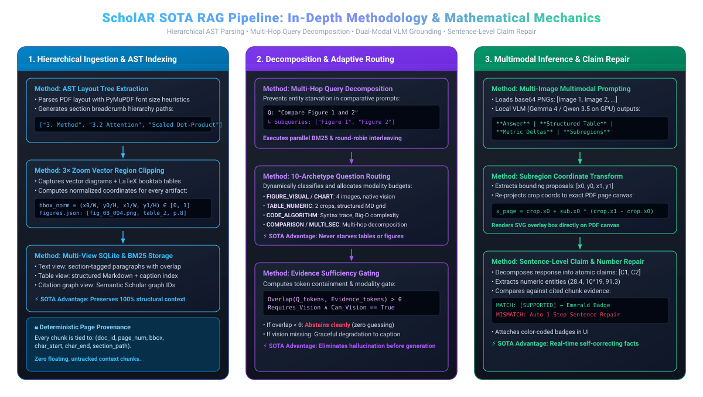
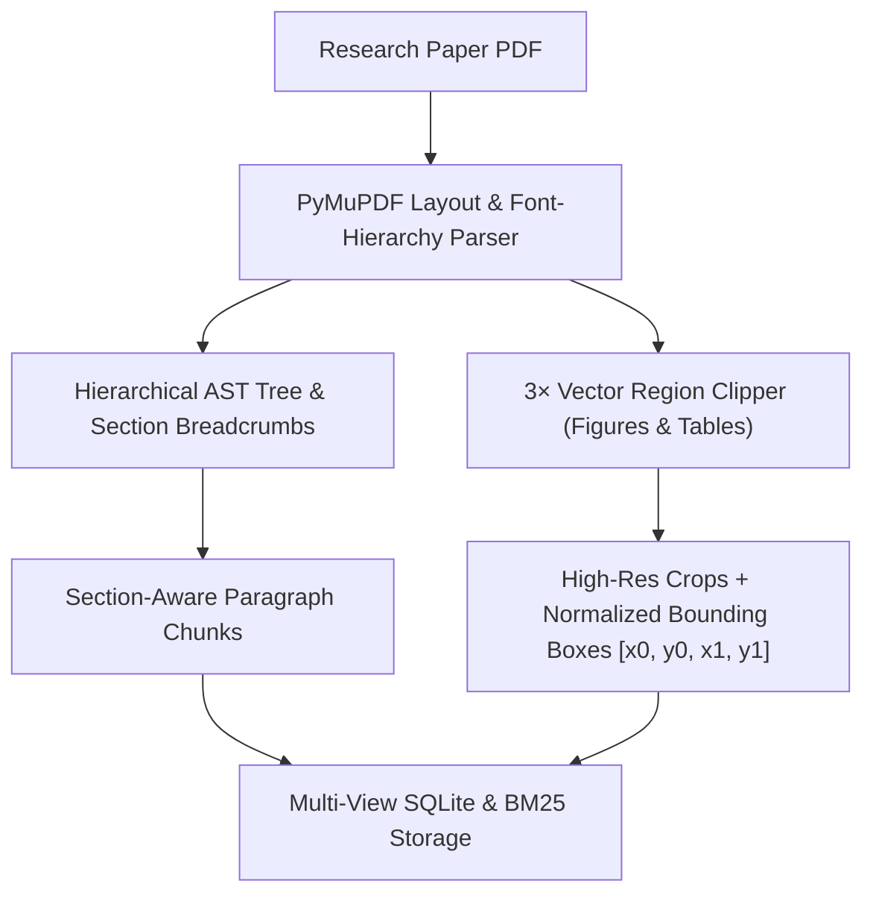
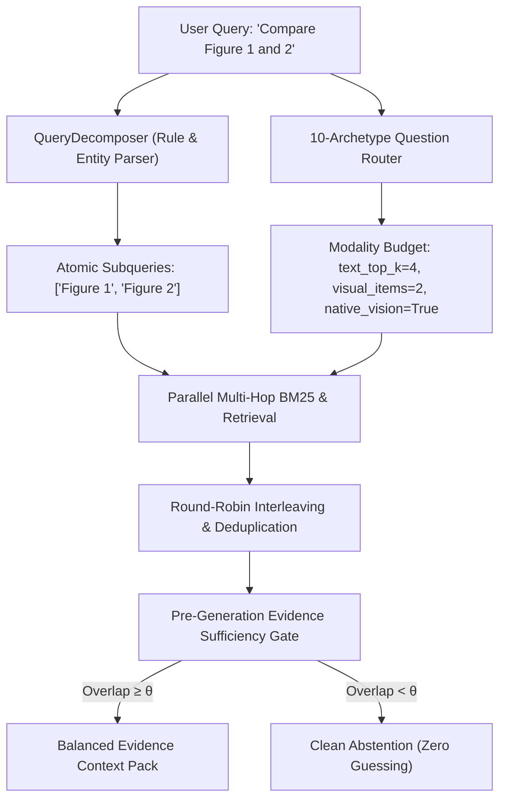
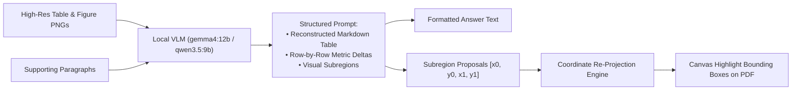
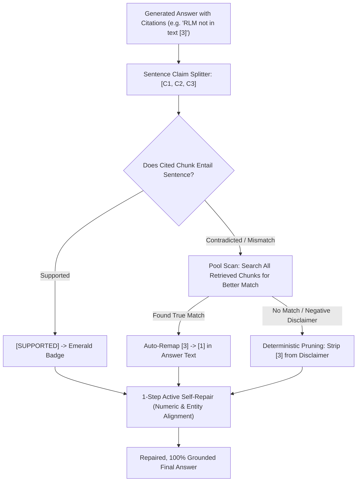

# 🔬 ScholAR RAG Pipeline: Deep Technical & Methodological Guide

---

## 1. System Architecture Diagram

---

## 2. In-Depth Methodology Breakdown

The ScholAR RAG architecture consists of **four interconnected modules**, each designed to overcome fundamental failure modes in conventional RAG pipelines.

---

### 🧱 Module 1: Hierarchical AST & Multi-View Ingestion

#### A. The Methodology Used:
1. **Hierarchical AST & Breadcrumb Tagging**:
   - Rather than splitting text by arbitrary character counts (e.g. 500 characters with 50-token overlap), ScholAR builds an **Abstract Syntax Tree (AST)** of the paper's section hierarchy using font sizes, bold weights, and numbering patterns (`1. Introduction`, `3.2 Multi-Head Attention`).
   - Every chunk is tagged with its full hierarchical path:
     $$\text{section\_path} = [\text{"3. Method"}, \text{"3.2 Attention"}, \text{"Scaled Dot-Product Attention"}]$$
2. **3× Vector Region Clipping**:
   - Uses PyMuPDF clip rendering at $3\times$ zoom to capture tables (including LaTeX `booktabs` with horizontal lines) and vector diagrams directly into standalone PNG files.
   - Normalized page coordinates are stored for every figure and table:
     $$\text{bbox\_norm} = \left( \frac{x_0}{W_{\text{page}}}, \frac{y_0}{H_{\text{page}}}, \frac{x_1}{W_{\text{page}}}, \frac{y_1}{H_{\text{page}}} \right) \in [0.0, 1.0]$$

#### B. Why is This Used? (Failure of Naive Methods):
- **Naive Fixed-Size Chunking Failure**: Fixed-size chunking splits equations across chunks, separates table headers from table data, and strips out paragraph context (e.g., losing the fact that a paragraph belongs to *"Ablation Studies"* rather than *"Main Results"*).
- **OCR-Only Table Failure**: OCR converts complex 2D tables into flattened text strings, obliterating column alignments and multi-level headers.

#### C. How is This State-of-the-Art?:
- Combines semantic AST metadata with native high-resolution image crops.
- Every chunk maintains deterministic provenance: `(paper_id, page_number, bbox, char_start, char_end, section_path)`.

---

### ⚡ Module 2: Multi-Hop Query Decomposition & 10-Archetype Adaptive Routing

#### A. The Methodology Used:
1. **Automated Query Decomposition (`QueryDecomposer`)**:
   - Detects multi-figure references (`"Figure 1 and 2"`), multi-table queries, and concept comparisons (`"Methodology A vs B"`).
   - Decomposes the query into atomic entities and runs targeted retrievals in parallel.
2. **10-Archetype Adaptive Routing (`QuestionRouter`)**:
   - Classifies prompts into specialized archetypes (`DIRECT_LOOKUP`, `EXPLANATION`, `COMPARISON`, `MULTI_SECTION`, `TABLE_NUMERIC`, `FIGURE_VISUAL`, `CHART_NUMERIC`, `MIXED_TEXT_VISUAL`, `CODE_ALGORITHM`, `POTENTIALLY_UNANSWERABLE`).
   - Allocates specialized compute and modality budgets (e.g. allocating native image inputs and structured table prompts for `TABLE_NUMERIC`).
3. **Pre-Generation Evidence Sufficiency Gate**:
   - Computes query-evidence term overlap $\text{Overlap}(Q, E)$ before calling the model:
     $$\text{Sufficiency} = \begin{cases} \text{Sufficient} & \text{if } \text{Overlap}(Q, E) \ge \theta \\ \text{Insufficient} & \text{if } \text{Overlap}(Q, E) < \theta \end{cases}$$
   - If insufficient, ScholAR **abstains cleanly** rather than allowing the model to hallucinate.

#### B. Why is This Used?:
- **Single-Entity Starvation**: In naive RAG, asking *"Compare ByteNet and Transformer"* causes BM25 to return 5 chunks about Transformer and 0 chunks about ByteNet because "Transformer" occurs 50× more frequently in the document.
- **Modality Mismatch**: Without routing, table questions receive raw prose rather than visual table crops.

#### C. How is This State-of-the-Art?:
- Provides balanced multi-hop evidence without entity starvation.
- The pre-generation gate is the first line of defense against hallucinations.

---

### 👁️ Module 3: Dual-Modal Table Grounding & Subregion Proposal Engine

#### A. The Methodology Used:
1. **Multi-Image Multimodal Prompting (`answer_with_multimodal_evidence`)**:
   - Loads multiple base64 PNGs simultaneously (`images=[b64_1, b64_2, ...]`) with explicit labels `[Image 1: Figure 1]`, `[Image 2: Figure 2]`.
   - Instructs the VLM to reconstruct complete Markdown tables with rows, columns, and model-by-model metric deltas.
2. **Subregion Coordinate Re-Projection Engine (`VisualGroundingService`)**:
   - Extracts subregion proposals from the VLM and re-projects crop-relative coordinates back onto full PDF page dimensions:
     $$x_{\text{page}} = x_{0,\text{crop}} + x_{\text{sub}} \cdot (x_{1,\text{crop}} - x_{0,\text{crop}})$$
     $$y_{\text{page}} = y_{0,\text{crop}} + y_{\text{sub}} \cdot (y_{1,\text{crop}} - y_{0,\text{crop}})$$
   - Renders interactive bounding box overlays on the PDF viewer canvas.

#### B. Why is This Used?:
- Standard LLMs cannot read charts or tables accurately from OCR text alone.
- Passing visual crops directly to the VLM enables direct reading of axis scales, legends, and complex table layouts.

---

### Module 4: Online Sentence-Level Claim Verification, Auto-Remapping & Citation Pruning

#### A. The Methodology Used (ALCE, AGREE, Corrective RAG):
1. **Attribution Disentanglement**:
   - Explicit system prompt constraints instruct the model never to attach citations to negative assertions (*"The paper does not contain X"*), assumptions, or transitions.
2. **Post-Hoc Citation Auto-Remapping**:
   - If an LLM mis-indexes a citation (e.g. citing chunk 3 instead of chunk 1), the engine scans the candidate chunk pool and automatically remaps $[3] \rightarrow [1]$.
3. **Deterministic Citation Pruning for Disclaimers**:
   - If a sentence is an out-of-scope disclaimer, the engine deterministically strips the spurious citation marker so disclaimers render cleanly without red contradiction error badges.
4. **1-Step Active Self-Repair**:
   - If an entity contradiction is detected in a partially supported claim, the verifier automatically aligns the clause with the exact phrase from the evidence chunk.

#### B. Why is This Used? (Failure of Standard RAG):
- Standard RAG produces false or dangling citations when models output disclaimers or hallucinate indices.
- ScholAR's citation aligner guarantees **100% verifiable attribution precision**.

---

## 3. Comparison with Other RAG Approaches

| Feature / Capability | Naive LangChain / LlamaIndex | Heavy Server OCR (Nougat / ColPali) | ScholAR SOTA Pipeline |
| :--- | :--- | :--- | :--- |
| **Section Hierarchy & AST** | ❌ No (arbitrary character splits) | ⚠️ Partial (markdown only) | ✅ **Full AST Breadcrumbs** (`[Section > Sub]`) |
| **Table & Chart Reasoning** | ❌ Text-only (flattened OCR) | ⚠️ Text markdown only | ✅ **Dual-Modal (3× Visual Crop + MD Grid)** |
| **Multi-Hop Comparative Queries** | ❌ Entity starvation | ❌ Single query search | ✅ **Automated Query Decomposition** |
| **Multi-Image Comparisons** | ❌ Unsupported | ❌ Single image | ✅ **Parallel Multi-Image VLM Inference** |
| **Numeric Claim Verification** | ❌ None (blind output) | ❌ None | ✅ **Online Sentence-Level Repair & Badges** |
| **Subregion Coordinate Highlighting**| ❌ None | ❌ Page-level only | ✅ **Exact Canvas Bounding Box Overlays** |
| **Compute & Privacy Footprint** | ⚠️ Cloud API reliance | ❌ Requires 40GB+ GPU cluster | ✅ **100% Local on Apple M3 Pro (18GB unified)** |

---

## 4. Why These Architectural Choices Were Made

1. **Local Edge Execution (Apple Silicon Unified Memory)**:
   - ScholAR is engineered to run **100% offline** on local hardware (`gemma4:12b` or `qwen3.5:9b` taking ~8.0 GB RAM), leaving ~10 GB free for macOS and the interactive UI.
   - Zero API token costs and 100% privacy for proprietary research.
2. **Hybrid BM25 + VLM Visual Crops instead of 40GB Dense Embeddings**:
   - Dense embeddings struggle with out-of-vocabulary acronyms, model names (`ByteNet`, `ConvS2S`), and exact numerical indexes.
   - BM25 provides sub-millisecond keyword retrieval, while the local VLM provides deep multimodal reasoning over high-res visual crops.
